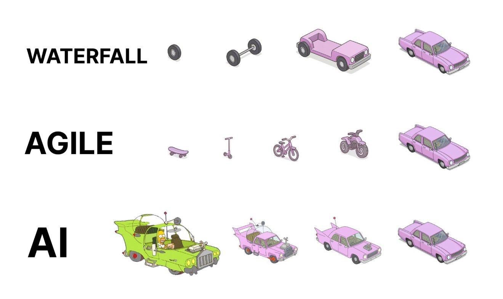

<!-- .slide: class="cover-1" -->
# Introdag 2

> Mens vi venter...
>
> lav et navneskilt
>

Notes:
- Husk A4 papir og tuscher
- Bed de studerende om at lave et navneskilt når de ankommer

---
<!-- .slide: class="o-academic-fire" -->
# Program
- Studiegrupper
- Hack dit studieliv
- AI og læring
- Erik kommer forbi
- Rundt i studiehåndbogen

---
<!-- .slide: class="cover-12" -->

# Hack dit studieliv

--

# Der er hjælp og vejledning

--


--

#### Code Lab
- Åbent mandag-fredag kl. 8.30-11.45 og 12.30-15.45 (bemandet)
- Dygtige studerende på senere semestre
- Du kan få hjælp til at:
  - forstå opgaver
  - forstå og skrive kode
  - komme videre i et projekt

--

#### Studievejledningen

- *"Jeg er i tvivl om jeg har valgt det rigtige studie"*
- *"De andre i studiegruppen irriterer mig og vi kan ikke arbejde sammen"*
- *"Jeg er dumpet en eksamen - hvad gør jeg?"*
- *"Jeg er stresset - hvad skal jeg gøre?"*
- *"Jeg bliver mega nervøs til eksamen - hvad kan jeg gøre?"*
- (og mange andre ting)
--

<iframe width="750" height="422" src="https://www.youtube.com/embed/fRYoFGXqCzQ?rel=0&showinfo=0&controls=0&privacy_mode=1" title="Studievejledningen" frameborder="0" allow="accelerometer; autoplay; clipboard-write; encrypted-media; gyroscope; picture-in-picture; web-share" referrerpolicy="strict-origin-when-cross-origin" allowfullscreen></iframe>

--

#### Studievejledning

- studievejledning@ek.dk
- 36 15 45 15

---
<!-- .slide: class="cover-14" -->

# AI og læring

--

Vi ser, at
- AI *kan* være et nyttigt værktøj i læringsprocessen,  

men vi ser også at 
- studerende får **dårligere færdigheder** og 
- har sværere ved at få udbytte af studiet - og gennemføre det

--



Notes:
- Her en lidt sjov tegning hvordan man kan udvikle en bil (set fra en software udviklers synspunkt)
- Der er to traditioner indenfor software udvikling, vandfaldsmetoden og den agile metode
- I vandfaldsmetoden planlægger vi hele forløbet og går frem efter planen. Således lægger vi hjul ud, forbinder dem med aksler osv.
- Den agile metode opnår det samme men i en iterativ metode, hvor man gradvist øger omfanget, men har et fungerende produkt i alle stadier. Dvs. først et skateboard, så et løbehjul etc, til sidst en bil
- I AI er det ret nemt at generere en fuld applikation. Det vi ofte ser her, er at udvikleren ender med at sidde og fjerne kode fra en fuld applikation indtil den gør det den skal. Det er en svær måde at lære på, da du som udvikler ikke er med i opbygningen og derfor har svært ved at redegøre for hvad du har lavet. Det er især et problem hvis du prøver at lære noget.

--

#### Faldgrupper ved AI

1. Overfladisk læring
2. Afhængighed
3. Mindre kreativitet og problemløsning
4. Misser at "fejl" er en vigtig del af læringsprocessen
5. Falsk sikkerhed
6. Plagiat og etik

Notes:
- Overfladisk læring
	- Hvis man altid får svaret serveret, risikerer man at springe over den dybe forståelse.
	- Man kan “løse opgaven” uden at kunne forklare løsningen bagefter.
	-  Eksempel: En SQL-forespørgsel genereret af ChatGPT virker – men man kan ikke selv tilpasse den, når kravene ændrer sig.
- Afhængighed
	- Risiko for at man altid tyr til ChatGPT i stedet for at tænke selv.
	- Kan sammenlignes med at bruge lommeregner uden nogensinde at lære hovedregning → man kan komme til at mangle fundamentale færdigheder.
- Mindre kreativitet og problemløsning
	- En stor del af at lære softwareudvikling er at finde løsninger på uklare problemer.
	- Hvis man altid starter med at spørge AI, kan man blive mindre trænet i selv at bryde problemer ned.
- "Fejl" er en vigtig del af læringsprocessen
	- At lave fejl og debugge selv er en vigtig del af at blive god til programmering.
	- Hvis ChatGPT retter det hele med det samme, mister man muligheden for at lære af egne fejl.
- Falsk sikkerhed
	- ChatGPT kan “hallucinere” og give et overbevisende men forkert svar.
	- Hvis studerende ikke lærer at være kritiske, kan de tage forkerte ting for gode varer.
- Plagiat og etik
	- Risiko for at aflevere AI-genereret tekst/kode uden at angive kilde.
	- Kan have konsekvenser
--

#### Fra studieordningen
Som udgangspunkt må du bruge værktøjer med kunstig intelligens (...), i forbindelse med eksamensopgaver (...), medmindre andet fremgår eksplicit af studieordningen eller opgavebeskrivelsen.

Men du skal være meget opmærksom på at lave korrekte referencer. Ellers vil EK betragte det som eksamenssnyd, da det vil være i strid med eksamensbekendtgørelsen, hvis du afleverer en besvarelse eller dele af en besvarelse, som fx er udarbejdet af en AI/chatbot, som om det var din egen.

--

#### Do's and Don'ts

- ✅ Brug AI til at få hjælp til at forstå koncepter
- ✅ Brug AI til at forstå fejl du får
- ❌ Brug *ikke* AI auto-completion når du koder
- ❌ Brug *ikke* AI til at løse opgaver for dig
- ❌ Tro ikke at du har forstået opgaven, bare fordi du har læst AI' svar

--

#### ❌ Don't - eksempel
```txt
Løs opgaven herunder i Java:    
Skriv en metode der tager et array   
af int som parameter og returnerer   
summen af alle elementerne i arrayet.
```

--

#### ✅ Do - eksempel
```txt
Jeg er ny i Java. Forklar mig hvad en static variabel er.
```

--

#### ✅ Do - eksempel

```txt
Jeg er ny til Java. Jeg har skrevet dette program,   
men jeg får en fejl: error: ';' expected. Hvad     
betyder det, og hvordan retter jeg det?    
 
public class Main {   
   public static void main(String[] args) {   
       System.out.println("Hej verden")    
   }
}
```
--
<!-- .slide: class="k-patrick-star" -->
## Leg

Ja eller nej

---
<!-- .slide: class="cover-10" -->
# Rundt i Studiehåndbogen

--

- Vi skal have adgang til mail, wifi, ItsLearning, etc.
- Vi bruger Studiehåndbogen til at finde informationer og guides
- På din computer: [https://mit.kea.dk/studiehaandbog](https://mit.kea.dk/studiehaandbog)

--
<!-- .slide: class="o-squidward" -->
#### Wifi

- Søg på studiehåndbogen efter "wifi"
- Følg instruktionerne for at få adgang til wifi

--
<!-- .slide: class="o-spongebob" -->
#### Studiemail og login

- Søg på studiehåndbogen 
	- "KEA login"
	- "KEA mail"
- Følg instruktionerne

--
<!-- .slide: class="o-focus-blue" -->
#### ItsLearning
- også kendt som *Fronter*
- Søg på studiehåndbogen efter "ItsLearning"
- Log ind med dit KEA login
- Find dit klasse*rum* og undervisningsplaner

--
<!-- .slide: class="o-daylight" -->
#### Servicedesk og Serviceportalen
- Søg på studiehåndbogen efter "Servicedesk"
- [servicedesk@ek.dk](mailto:servicedesk@ek.dk)
- Frontdesk i bygning A ved receptionen

--
<!-- .slide: class="o-poolside-study" -->
#### UMS
- Søg på studiehåndbogen efter "UMS"
- Log ind med dit KEA login
- Se dit skema for semesteret

--
<!-- .slide: class="o-pencil-grey" -->
#### Office 365
- Søg på studiehåndbogen efter "Office 365"
- Log ind med dit KEA login
- Find Office 365 apps som Word, Excel, PowerPoint, OneDrive og Teams

--

<!-- .slide: class="o-tinky-winky" -->
#### Teams

- Nogle lektioner foregår i Teams
- Lad os teste at alle kan logge ind i Teams

--
<!-- .slide: class="o-bluey" -->
#### LinkedIn Learning

- LinkedIn Learning kan bruges som forberedelse til undervisningen
- Opret en konto i LinkedIn, hvis du ikke har en
- Tilknyt din KEA-mail til LinkedIn Learning 
	- vha. [https://www.linkedin.com/learning/activate](https://www.linkedin.com/learning/activate)
- Find kurset **Learning Java 17** af **Kathryn Hodge**
