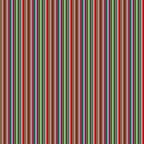
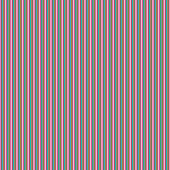
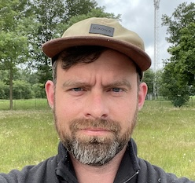
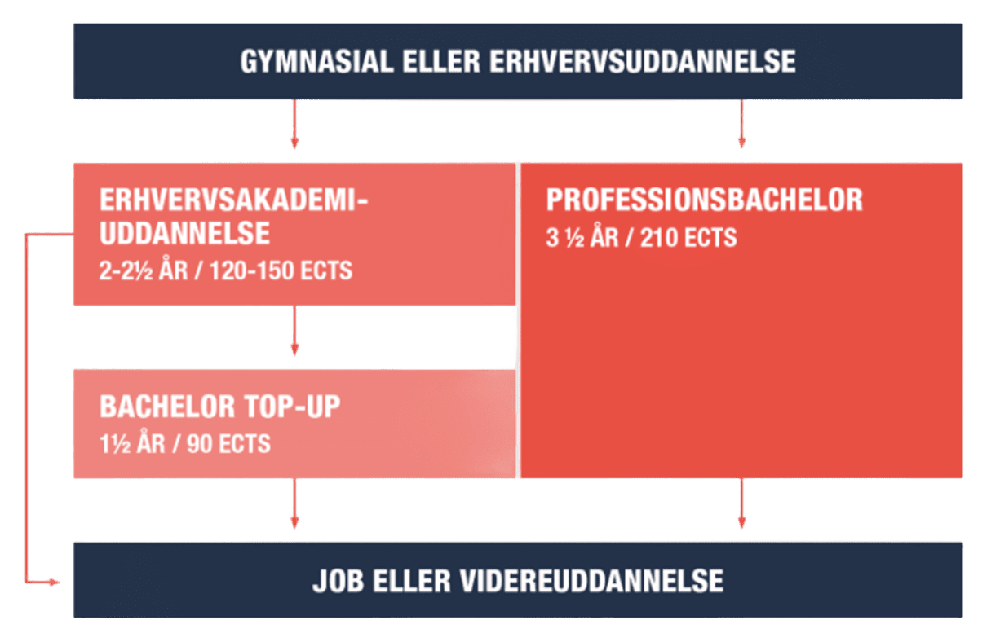

<!-- .slide: class="cover-2" -->
# Introdage

---
<!-- .slide: class="ek-academic-fire" -->
# Program
- Os og jer
- EK/KEA og studiet
- Forventningsafstemning af første semester
- Studiegrupper
- Fronter
- ChatGPT og videoer

---

<!-- .slide: class="ek-daylight" -->
# Os

--

Underviser i *Systemudvikling*

 
## *Lasse*

[LAVO@ek.dk](mailto:LAVO@ek.dk)

--

Underviser i *Virksomhed*

 
## *Stig*

[STSS@ek.dk](mailto:STSS@ek.dk)

--

Underviser i *Programmering*

## *Jakob*
[JANO@ek.dk](mailto:JANO@ek.dk)

--
<!-- .slide: class="k-focus-blue" -->
# Jer

--

- Tag 5 samtale-kort fra bunken heroppe
- Gå rundt i blandt hinanden
- Hils på hinanden med navn og stil et spørgsmål

--

Uddannelseschef på *Datamatiker* (og min chef)

# *Erik Christian Hansen*

[ECHA@ek.dk](mailto:ECHA@ek.dk)

... kommer forbi og siger hej i morgen

--

Leder på EK Digital (og min chefs chef)

# *Frederikke*

--

...og rektor

han vil gerne byde jer velkommen

<iframe width="750" height="422" src="https://www.youtube.com/embed/kuQQk02CYWY?rel=0&showinfo=0&controls=0&privacy_mode=1" title="Velkommen til EK" frameborder="0" allow="accelerometer; autoplay; clipboard-write; encrypted-media; gyroscope; picture-in-picture; web-share" referrerpolicy="strict-origin-when-cross-origin" allowfullscreen></iframe>

---

# Uddannelsen

--

Ca. 400 studerende
Ca. 25 undervisere

---

5 semestre = 2½ år

---
# Eksamener på Datamatikeruddannelsen
8-9 eksamener

En rapport

Afsluttende eksamen
3 adskilte eksamener
3 adskilte eksamener
75%
25%

---
# Fokus på 1.semester

Tre fagelementer
Programmering:
”Hvordan man i praksis konstruerer programmer – ved brug af værktøjer og metoder brugt i branchen”

Systemudvikling:
”Alt det der støtter op om selve programmeringen – planlægning, design, kvalitetssikring

Virksomheden:
”Dem der aftager programmerne, og betaler os for at lave dem”

---
# Ugeplan på 1. semester

Code Lab
Åben - 40 timer

IT og forretnings-forståelse

Softwareudvikling
Programmering
12 lektioner+Systemudvikling
2 lektioner
6 lektioner

---
# ECTS
Eksamen
| Emne | Studieordning: Semester (ECTS) |
| --- | --- |

|  | 1. Semester |  | 2. Semester |  | 3. Semester |  | 4. Semester |  | 5. Semester |  |
| --- | --- | --- | --- | --- | --- | --- | --- | --- | --- | --- |
| Programmering | 15 ECTS |  | 15 ECTS |  |  |  |  |  |  |  |
| Systemudvikling | 10 ECTS |  | 5 ECTS |  |  |  |  |  |  |  |
| Teknologi |  |  | 5 ECTS |  |  |  |  |  |  |  |
| Virksomhed | 5 ECTS |  | 5 ECTS |  |  |  |  |  |  |  |
| Programmering 2 |  |  |  |  | 10 ECTS |  |  |  |  |  |
| Systemudvikling 2 |  |  |  |  | 10 ECTS |  |  |  |  |  |
| Teknologi 2 |  |  |  |  | 10 ECTS |  |  |  |  |  |
| Valgfag |  |  |  |  |  |  | 30 ECTS |  |  |  |
| Praktik |  |  |  |  |  |  |  |  | 15 ECTS |  |
| Afsluttende projekt |  |  |  |  |  |  |  |  | 15 ECTS |  |

---
Klasse-undervisning
Studiegrupper
Studenter-præsentationer
Hvordan lærer du
Diskussioner
Code Lab
Gruppearbejde
Praktiske opgaver
Større projekter med vejledning
Problemløsning
øvelser

---

# Find vej

---

---

Placering
Bygninger
Indgang(e)
Organisation
Uddannelser

---

---

Datamatiker
Klik på link for at se de andre etager:
https://kea.dk/images/DA/Files/Om-KEA/GBG_Wayfinding.pdf

Reception

---
Indgange til bygning E
Via gården, og op ad trappen
Meinungsgade 8 – rundt om hjørnet

---
Adgang med studiekort
Har I fået lavet studiekort?

---

---
# Rollen som studerende

---
# Nye ord

<strike>skole</strike>&nbsp;&nbsp;*uddannelse*
<strike>elev</strike>&nbsp;&nbsp;*studerende*
<strike>lærer</strike>&nbsp;&nbsp;*underviser*
<strike>lektier</strike>&nbsp;&nbsp;*opgaver*

---
# Hvad er forskellen på elev og studerende?

---
# Studerende er selv ansvarlige for at lære
Underviserens opgave:
	At facilitere læring – stille muligheder til rådighed, og 	svare på spørgsmål fra studerende.

Studerendes opgave:
	At tage ansvar og aktivt vælge at ville lære – ved at 	deltage i undervisningen og lave øvelser og opgaver. 	Og     	at stille spørgsmål!

---
# Krav om studieaktivitet
Der er ikke krav om fremmøde eller afleveringer – der er/er ikke registrering af fravær eller trusler om eksamen i fuld pensum.

Men det er dumt at blive væk og ikke lave noget – for så lærer man ingenting. Der er dog obligatoriske opgaver hvor deltagelse er en forudsætning for at kunne deltage i eksamenen

---
# Krav om studieaktivitet
43 timer
forventet gennemsnitlig studietid pr. uge

---
# Hack dit studieliv

---
# Det er ok at have en dårlig dag

---
# Men mød op alligevel- det er bedre at du kommer en time for sent – end ikke

---
# Men en dårlig dag er bedre for dig her end derhjemme

---
# Repetition:Det er bedre at gøre det hver dagend en gang om ugeneller før eksamen

---
# Vi lærer når vi soverJo flere gange du sover på det jo bedre

---
# RepetitionerLæs - forberedeUndervisningØvelserProjekterEksamen- hver gang sidder det lidt mere fastDet er vigtigt for at klare næste semester at viden sætter sig fast

---
# Ha’ det rartVi husker bedst gode oplevelser

---
# NytårsfortsætFortæl de andre om dit nytårsfortsæt- lykkedes det?

---
# VanerMotivation holder 14 dageVaner får dig i mål

---
# - gode søvnvaner. gode studievaner

---

13. august 2025
“We do not learn from experience... we learn from reflecting on experience.”
Dewey, J "How we think" 1910

---
# Deweys klassiske eksempel

Når man ved et uheld træder i en vandpyt, oplever man en irritation, noget uventet og uplanlagt, og man begynder at tænke over hvordan man kan undgå det fremover …

---

Når hjernen skal skabe helt nye forbindelser
…
Så lærer du!

Det kan godt være hårdt …

---
Learning is deeper and more durable when it’ effortful!!

eller som vi siger nede i centeret

---
# Hvad er så underviserens rolle?

Når vi nu ikke bare kan fylde viden på jer …

---
# Vi designer et forløb med oplevelser der får jer til at sige hmmm …

---
Peter Jarvis’ model for læring
ekstremt nørdet
læringsteorisnak …
- bare nik og smil

---
# undervisernes job er at lede jer ind på denne sti
At opstille situationer der giver jer oplevelser, og guide jer gennem refleksioner og eksperimenter, der udfordrer jer, får jer til at reflektere, forstå og huske – og lære at kunne, ikke bare vide!

---
# Der er altid et element af praksis involveret
Fordi:
Du skal ikke bare vide. Du skal kunne.

---
# Så derfor
Når vi giver jer (hjemme)opgaver
Er det for at opleve “things that make you go hmm” og tvinge jer til at reflektere og eksperimentere.
Når vi stiller spørgsmål
Er det for at få jer til at reflektere – eller finde viden frem, for at hjælpe jer til at huske.
Når vi giver jer øvelser
Er det for at lade jer opleve ting selv, fremfor bare at se på os.

---

Husk!
Det handler aldrig om løsningen!
Men hvordan kommer du frem til den rigtige kvalitetsløsning på den mest optimale måde!

---
# Arbejd!, arbejd!, arbejd!

Det handler ikke om at aflevere – ligesom det ikke handler om løsningen.
Det handler om arbejdet – det er arbejdet der gør at I lærer – og I er her for at lære – ikke for at vise os at I kan aflevere opgaver.
Vi holder ikke kontrol med jer – vi tilbyder undervisning og opgaver for at I kan træne jer selv – ikke for at vi kan holde øje med jer.
Så uanset hvad der sker – så bare svøm arbejd videre!

---

---
# Der er en grund til at I er her som et hold

---
# Husk: I er ikke alene!

Studiegrupper
En af de bedste måder at lære på, er ved at man sammen finder ud af ting.

Derfor vil vi kraftigt opfordre til at i danner studiegrupper

---
Det er godt at have nogle at studere med

Det er godt at have nogle at fejre succeserne med

og nogle at dele nederlagene med

---
# Hvad så med AI?
I må rigtigt gerne bruge AI til at:
- Hjælp til at forstå koncepterne bedre
- Få feedback til den kode man har skrevet eller ens forståelse af et emne
- Bruge AI til at forklare programmeringskoncepter på en simpel måde
- Bruge AI som opslagsværk til fx at se hvordan man itererer en liste i Java
- Få hjælp til at finde læringshuller
- Bruge AI til at øve jeres tekniske vokabularium. Iterere et array, kalde en funktion, variablen er immutable, etc.
- Bruge AI til at teste jeres viden

---
# Hvad så med AI?
I må ikke bruge AI til at:
- At lave koden for jer
- Løse opgaver for jer
- Få AI til at generere løsningen på en opgave for derefter læse opgaven igennem og tro at man forstår
Det kode som er i jeres projekter, skal i kunne stå på mål for og forklare!

---
# Fra studieordningen
Brug af kunstig intelligens (AI), herunder ChatGPT eller lignende programmer

Som udgangspunkt må du bruge værktøjer med kunstig intelligens (AI), herunder ChatGPT eller lignende chatbots og programmer, i forbindelse med eksamensopgaver (mundtlige og skriftlige), medmindre andet fremgår eksplicit af studieordningen eller opgavebeskrivelsen.

Men du skal være meget opmærksom på at lave korrekte referencer. Ellers vil KEA betragte det som eksamenssnyd, da det vil være i strid med eksamensbekendtgørelsen, hvis du afleverer en besvarelse eller dele af en besvarelse, som fx er udarbejdet af en AI/chatbot, som om det var din egen.

Dette følger af eksamensbekendtgørelsen i § 34, stk. 2, pkt. 3, at ”eksamenssnyd foreligger bl.a., når den studerende […] fortier eller vildleder om egen indsats eller resultater”.

---

KONTAKT
Service DeskEmail: servicedesk@kea.dk Telefon: +45 4646 0046
Spørgsmål vedr. eksamenEmail: eksamen@kea.dk
Studieadministration Email: studie@kea.dk
Studievejleder - Düncap Ünkap Andersen Email: duun@kea.dk
studievejledningen@kea.dk
ÅBNINGSTIDER
GULDBERGSGADE 29N
Hverdage:Kl. 07:00 – 22:00
Weekender:Kl. 10:00 – 22:00
Reception:man - fre: 08:00 - 15:00
Husk Studiekort!

---

Trådløst netværk

Kantine – Bygning A

Studenterbar – Bygning B- Studieliv

---
Kommunikation
Fronter - https://ek.itslearning.com
Semesterplan, bogliste, materialer, opgaver

E-mail
Al e-mail kommunikation er via din EK mail
Du kan opsætte mail forwarding fra din EK mail til privat email

SMS - Tilføj mobilnummer til ums.kea.dk

Skema
http://skema.kea.dk
Kan også ses i http://ums.kea.dk og i din KEA-mail-kalender

Studiestartsinfo på http://it.kea.dk

---
Rygepolitik og nødplan

Rygning er ikke tilladt på KEA.

Hjertestarter

I nødstilfælde, brug brandtrappen og nødudgange.
Gå til samlingssted (er oplyst på brandinstruktionen i alle lokaler).
Emergency plan: https://mit.kea.dk/studiehandbog/brand-og-beredskab
Guldbergsgade 29N, 2200 København N:
	Placeret ved trapperne ved receptionen

Håndværkergården, Meinungsgade 8, 2200 København N
	Placeret ved trapperne i stueetagen

---
Videoer:
Studie & Karrierevejledning:  https://youtu.be/fRYoFGXqCzQ

IT-intro: https://www.youtube.com/watch?v=inLf-ATmlAQ

Links:
Bibliotek: https://bibliotek.kea.dk/da/

Studiehåndbog: https://mit.kea.dk/studieh%C3%A5ndbog

Studiekort: https://keastudiekort.dk/

---

Spørgsmål?