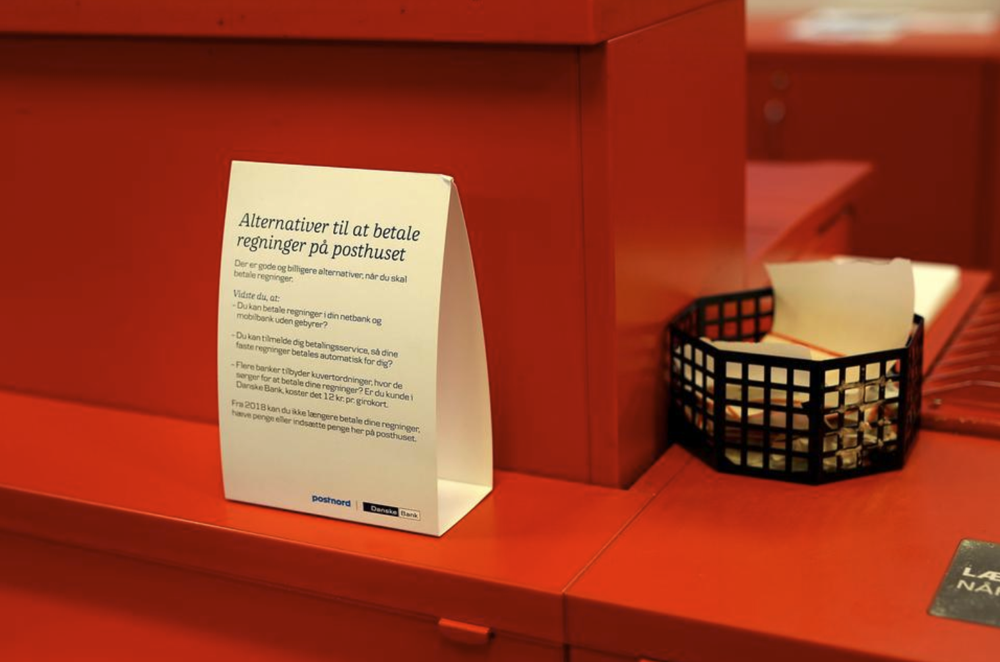
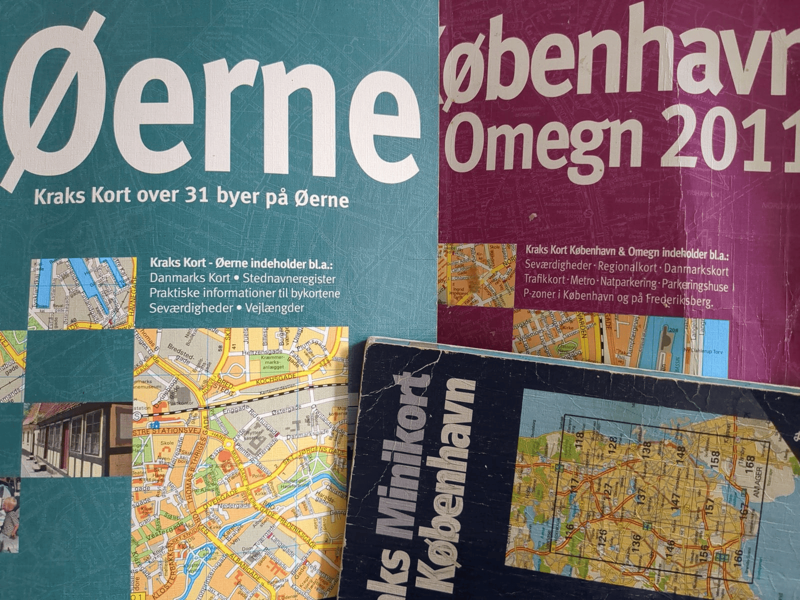
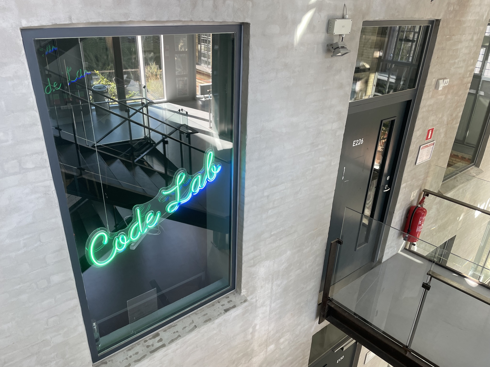

<!-- .slide: class="cover-2" -->
# Introdage

---
<!-- .slide: class="o-academic-fire" -->
# Program
- Os og jer
- EK/KEA og studiet
- Forventningsafstemning af første semester
- Studiegrupper
- Fronter
- ChatGPT og videoer

---

<!-- .slide: class="cover-7" -->
# Os og jer

--

Underviser i *Systemudvikling*

 
## *Lasse*

[LAVO@ek.dk](mailto:LAVO@ek.dk)

--

Underviser i *Virksomhed*

 
## *Stig*

[STSS@ek.dk](mailto:STSS@ek.dk)

--

Underviser i *Programmering*

## *Jakob*
[JANO@ek.dk](mailto:JANO@ek.dk)

--
<!-- .slide: class="cover-15" -->
## Jer

--

- Tag 5 samtale-kort fra bunken heroppe
- Gå rundt i blandt hinanden
- Hils på hinanden med navn og stil et spørgsmål

--

Uddannelseschef på *Datamatiker* (og min chef)

# *Erik Christian Hansen*

... kommer forbi og siger hej i morgen

--

Leder på EK Digital (og min chefs chef)

# *Frederikke*

--

...og rektor på EK

<iframe width="750" height="422" src="https://www.youtube.com/embed/kuQQk02CYWY?rel=0&showinfo=0&controls=0&privacy_mode=1" title="Velkommen til EK" frameborder="0" allow="accelerometer; autoplay; clipboard-write; encrypted-media; gyroscope; picture-in-picture; web-share" referrerpolicy="strict-origin-when-cross-origin" allowfullscreen></iframe>

Notes:
- Rektor vil gerne byde jer velkommen til EK

---

# Uddannelsen

--

- 400 studerende
- 25 undervisere
- 5 semestre
- 150 ECTS

--

<table class="education">
<tr>
	<th>1. SEMESTER</th>
	<th>2. SEMESTER</th>
	<th>3. SEMESTER</th>
	<th>4. SEMESTER</th>
	<th>5. SEMESTER</th>
</tr>
<tr>
	<td class="light-red" rowspan="3">PROGRAMMERING 1 (15 ECTS)</td>
	<td class="light-red" rowspan="3">PROGRAMMERING 1 (15 ECTS)</td>
	<td class="light-red" rowspan="2">PROGRAMMERING 2 (10 ECTS)</td>
	<td class="light-red" rowspan="2">VALGFAG 1 (10 ECTS)</td>
	<td class="dark-red" rowspan="3">PRAKTIK (15 ECTS)</td>
</tr>
<tr>
</tr>
<tr>
	<td class="light-red" rowspan="2">SYSTEMUDVIKLING (10 ECTS)</td>
	<td class="light-red" rowspan="2">VALGFAG 2 (10 ECTS)</td>

</tr>
<tr>
	<td class="light-red" rowspan="2">SYSTEMUDVIKLING (10 ECTS)</td>
	<td class="light-red">SYSTEMUDVIKLING (5 ECTS)</td>
	<td class="dark-red" rowspan="3">AFGANGSPROJEKT (15 ECTS)</td>
</tr>
<tr>
	<td class="light-red">TEKNOLOGI 1 (5 ECTS)</td>
	<td class="light-red" rowspan="2">TEKNOLOGI 2 (10 ECTS)</td>
	<td class="light-red" rowspan="2">VALGFAG 3 (10 ECTS)</td>
</tr>
<tr>
	<td class="light-red">IT- OG FORRETNINGS- UDVIKLING (5 ECTS)</td>
	<td class="light-red">IT- OG FORRETNINGS- UDVIKLING (5 ECTS)</td>
</tr>
</table>

--

8-9 eksamener

--

1. semester
	- Programmering 1 - *Mundtlig eksamen* (15 ECTS)  
2. semester
	- Programmering 1/Systemudvikling 1/IT- og forretn. 1 og Teknologi 1 - *Projekt og mundtlig eksamen* (15 ECTS)
3. semester
	- Programmering 2 - *Mundtlig eksamen* (10 ECTS)
	- Systemudvikling 2 - *Mundtlig eksamen* (10 ECTS)
	- Teknologi 2 - *Mundtlig eksamen* (10 ECTS)
4. semester
	- Valgfag 1 - *Prøve* (10 ECTS)
	- Valgfag 2 - *Prøve* (10 ECTS)
	- Valgfag 3 - *Prøve* (10 ECTS)
5. semester
	- Praktik - *Skriftlig eksamen* (15 ECTS)
	- Afsluttende projekt - *Projekt og mundtlig eksamen* (15 ECTS)
--
# 1. semester

--

#### Programmering
"Hvordan man i praksis konstruerer programmer  
\- ved brug af værktøjer og metoder brugt i branchen"

--

#### Systemudvikling
"Alt det der støtter op om selve programmeringen  
– planlægning, design, kvalitetssikring"

--

#### IT- og forretningsudvikling
"Dem der aftager programmerne,  
og betaler os for at lave dem"

--

#### Undervisningen

- Klasseundervisning
- Øvelser
- Problemløsning
- Diskussioner
- Studenter-præsentationer
- Gruppearbejde
- Større projekter med vejledning

--

#### Eksempeluge 1. semester

--

|               | Mandag               | Tirsdag                | Onsdag               | Torsdag              | Fredag                           |
|---------------|----------------------|------------------------|----------------------|----------------------|----------------------------------|
| 8:30 - 11:45  | Program- mering 1 |                        | Program- mering 1 |                      | IT- og forret- ningsudvikling |
| 12:30 - 14:00 |                      | System- udvikling 1 |                      | Program- mering 1 |                                  |

--
... MEN skemaet kan ændre sig fra uge til uge

Se skemaet på [https://ums.ek.dk/

---

# Find vej på EK

--

- E: Datamatiker, Code Lab, cafe, studievejledningen
- A: Kantine, servicedesk, biblioteket, cykelparkering
- B: Studenterbaren

Notes:
- Vi er i næsten udelukkende i bygning E
- Kantinen er i bygning A
- Studenterbaren er i bygning B
- Gå ind fra Meinungsgade 8
- Cykelparkering i kælderen
- Ingen bilparkering

--

Indgang fra Meinungsgade 8

--

#### Adgang med studiekort

Har I fået lavet studiekort?
...ellers [https://ekstudiekort.dk/](https://ekstudiekort.dk/)
--

#### Lokaler

**GBG.E236** betyder:
- Campus GBG, Guldbergsgade
- Bygning E
- 2\. sal
- Lokale 236

--

#### Foto orienteringsløb på campus

- 30 min.
- Hold a 2-3 personer
- Besøg hvert sted på kortet
- Find det foto der passer til stedet

---

# En fremtid som datamatiker

--

#### Da jeg var barn...

Notes:
- Da jeg var barn skulle mine forældre på posthuset for at betale regninger, fx husleje

--

#### Da jeg var barn...

Notes:
- Hvis man bruge et stort beløb kunne man skrive en check, så kunne modtageren indløse den i sin bank.

--

#### Da jeg var barn...

Notes:
- Skulle man købe en rejse, skulle man gå til et rejsebureau.
- Rejsebureauet skulle kontakte flyselskabet for at booke billetter.
- SAS blev markedsleder da de begyndte at tilbyde online booking - et af Danmarks tidligste IT-projekter. De kunne tilbyde en rejse næste dag, hvilket var en kæmpe fordel for businesskunder.

--

#### Da jeg var barn...

--

Digitale produkter løser problemer for mennesker

--

Det danske samfund er i front når det kommer til digitalisering   
 \- det er en kæmpe effektivitetsgevinst  
 \- mennesker kan løse opgaver med mening i

--

Brug 5 min til at tænke over:  
\- Hvilke digitale produkter bruger du i din hverdag?  
\- Hvilke problemer løser de for dig?

Notes:
- De der har forslag må gerne sige dem højt
---

# Rollen som studerende

--
# Nye ord

- <strike>skole</strike>&nbsp;&nbsp;*uddannelse*
- <strike>elev</strike>&nbsp;&nbsp;*studerende*
- <strike>lærer</strike>&nbsp;&nbsp;*underviser*
- <strike>lektier</strike>&nbsp;&nbsp;*øvelser*

--

Der er **ingen** årskarakterer

--

... så du kan roligt sige, hvis der er noget du ikke forstår

--

Der er **ikke** krav om fremmøde

--
<!-- .slide: class="cover-9" -->

#### ... men det er dumt at blive væk

Notes:
- Vi ser en tydelig sammenhæng mellem fremmøde og beståelse af eksamen

--

#### 30 ECTS = en fuldtidsstilling
\- og du får SU for det

Notes:
- Du skal regne med at bruge 37 timer om ugen på studiet
- Det er et fuldtidsstudie
- Det er et fuldtidsjob

--

### En tillidserklæring
- du får SU
- du får en gratis uddannelse
- andre var kvalificerede, men fik ikke plads

--

Hvis du skal tage noget med fra i dag, så er det:

--
<!-- .slide: class="cover-3" -->
> ## Mød op!
>
> Har du en dårlig dag, så mød op alligevel.
>
> Den dårlige dag er bedre her - end derhjemme

Notes:
- Det er bedre at komme en time for sent end ikke at komme

--

Din fremtid som software udvikler er også
- #### fælles ejerskab
- #### vidensdeling
- #### samarbejde
- #### pair programming

Notes:
- Kollegaskab, vidensdeling, fælles ejerskab for software og projekter er en essentiel del af dit fremtidige job som softwareudvikler ... og en efterspurgt kompetence hos udviklere. 

--

Tænk på dit studie som et

## arbejdsfælleskab

Notes:
- Vi behøver ikke at være *best pals*
- Men opgaver løses bedst i grupper - så bidrag hvor du kan
- Måske er du god til macOS, måske fangede du hurtigt, hvad øvelsen gik ud på 

--

Feedback fra virksomheder: 
#### Ikke nok at være god til at kode

--

## Soft skills
- Teamwork
- Kreativitet
- Mentoring/vidensdeling
- Kommunikation

Notes:
- Teamwork:
	- Håndtere uenigheder og forskellige meninger
	- Lytte til andres ideer og give konstruktiv feedback
	- Bidrage til et positivt arbejdsmiljø
- Kreativitet:
	- Hvordan løser vi et problem digitalt - så det giver mening for brugeren - er robust for fejl - kan imødese fremtidige behov
	- Være åben for nye ideer og tilgange
- Mentoring/vidensdeling:
	- At dele viden og erfaringer med andre
	- At hjælpe andre med at vokse og udvikle sig
- Kommunikation:
	- At kunne forklare komplekse tekniske emner på en simpel måde - bl.a. til ikke-tekniske personer, herikluderet kunder
	- At kunne lytte og forstå andres behov og perspektiver
--

#### ... så *mød op!*

---
<!-- .slide: class="cover-11" -->

# Hack dit studieliv

--

--

### Repetition

--

- Nye informationer lagres først i **korttidshukommelsen**
- Gentagelse flytter viden til **langtidshukommelsen**

--

### The *spacing effect*

Det er bedre at øve klaver  
**10 minutter hver dag**  
end 1 time én gang om ugen

--

Undervisningen kommer omkring emnerne flere gange
- Forberedelse
- Undervisning
- Øvelser
- Projekter
- Forberedelse til eksamen

--

### Nytårsfortsæt

--
Fortæl de andre om et **nytårsfortsæt** - hvor lang tid holdt det?

Notes:
- Lad de studerende fortælle om deres nytårsfortsæt
- Spørg ind til hvad der gjorde at de ikke holdt det

--

Har du haft tanken:

> ### Hvad er der galt med mig, når jeg ikke kan holde mine nytårsfortsætter?

--

God nyhed:
> ### Det er ikke dig, der er noget galt med

--

Motivation holder 14 dage
### \- vaner får dig i mål

Notes:
- Vi mennsker er vanedyr
- De færreste kan drive noget frem alene med viljestyrke
- Det meste af det vi gør, er vaner
- Det er ikke nemt at etablere nye vaner
- Du kan udnytte andre vaner når du etablerer nye vaner

--

Du har 14 dage til at etablere et nyt system, der er pærelet at følge

--

Eksempel:
> Jeg vil gerne komme i bedre løbeform

--

Dårligt system (for Jakob)
- Jeg skal løbe mandag og torsdag når børnene er faldet i søvn

... FAIL!

Notes:
- Jeg kan ligeså godt gøre det i tirsdag og fredag
- Jeg er træt og kan ikke tage mig sammen til noget om aftenen

--

Godt system
- Jeg skal løbe kort tur hver dag kl. 7:00
- Jeg sætter min alarm til at ringe kl. 22:00
- Jeg lægger mit løbetøj frem
- Jeg sætter min alarm til kl. 6:30
- Jeg står op og tager løbetøjet på

--

Eksempel:
> Jeg vil gerne komme i bedre løbeform
- Jeg sætter min alarm til kl. 22:00
- Jeg lægger mit løbetøj frem
- Jeg står op og tager løbetøjet på

--

--

# Der er altid et element af praksis involveret
Fordi:
Du skal ikke bare vide. Du skal kunne.

--
# Så derfor
Når vi giver jer (hjemme)opgaver
Er det for at opleve “things that make you go hmm” og tvinge jer til at reflektere og eksperimentere.
Når vi stiller spørgsmål
Er det for at få jer til at reflektere – eller finde viden frem, for at hjælpe jer til at huske.
Når vi giver jer øvelser
Er det for at lade jer opleve ting selv, fremfor bare at se på os.

--

Husk!
Det handler aldrig om løsningen!
Men hvordan kommer du frem til den rigtige kvalitetsløsning på den mest optimale måde!

--
# Arbejd!, arbejd!, arbejd!

Det handler ikke om at aflevere – ligesom det ikke handler om løsningen.
Det handler om arbejdet – det er arbejdet der gør at I lærer – og I er her for at lære – ikke for at vise os at I kan aflevere opgaver.
Vi holder ikke kontrol med jer – vi tilbyder undervisning og opgaver for at I kan træne jer selv – ikke for at vi kan holde øje med jer.
Så uanset hvad der sker – så bare svøm arbejd videre!

--

--
# Der er en grund til at I er her som et hold

--
# Husk: I er ikke alene!

Studiegrupper
En af de bedste måder at lære på, er ved at man sammen finder ud af ting.

Derfor vil vi kraftigt opfordre til at i danner studiegrupper

--
Det er godt at have nogle at studere med

Det er godt at have nogle at fejre succeserne med

og nogle at dele nederlagene med

--

--

# Få vejledning og støtte

--

# Code Lab
- Åbent mandag-fredag kl. 8.30-11.45 og 12.30-15.45 (bemandet)
- Dygtige studerende på senere semestre
- Du kan få hjælp til at:
  - forstå opgaver
  - forstå og skrive kode
  - komme videre i et projekt

--

# Studievejledning

- *"Jeg er i tvivl om jeg har valgt det rigtige studie"*
- *"De andre i studiegruppen irriterer mig og vi kan ikke arbejde sammen"*
- *"Jeg er dumpet en eksamen - hvad gør jeg?"*
- *"Jeg er stresset - hvad skal jeg gøre?"*
- *"Jeg bliver mega nervøs til eksamen - hvad kan jeg gøre?"*

--

# Studievejledning

- 
- 

--
# Hvad så med AI?
I må rigtigt gerne bruge AI til at:
- Hjælp til at forstå koncepterne bedre
- Få feedback til den kode man har skrevet eller ens forståelse af et emne
- Bruge AI til at forklare programmeringskoncepter på en simpel måde
- Bruge AI som opslagsværk til fx at se hvordan man itererer en liste i Java
- Få hjælp til at finde læringshuller
- Bruge AI til at øve jeres tekniske vokabularium. Iterere et array, kalde en funktion, variablen er immutable, etc.
- Bruge AI til at teste jeres viden

--
# Hvad så med AI?
I må ikke bruge AI til at:
- At lave koden for jer
- Løse opgaver for jer
- Få AI til at generere løsningen på en opgave for derefter læse opgaven igennem og tro at man forstår
Det kode som er i jeres projekter, skal i kunne stå på mål for og forklare!

--
# Fra studieordningen
Brug af kunstig intelligens (AI), herunder ChatGPT eller lignende programmer

Som udgangspunkt må du bruge værktøjer med kunstig intelligens (AI), herunder ChatGPT eller lignende chatbots og programmer, i forbindelse med eksamensopgaver (mundtlige og skriftlige), medmindre andet fremgår eksplicit af studieordningen eller opgavebeskrivelsen.

Men du skal være meget opmærksom på at lave korrekte referencer. Ellers vil KEA betragte det som eksamenssnyd, da det vil være i strid med eksamensbekendtgørelsen, hvis du afleverer en besvarelse eller dele af en besvarelse, som fx er udarbejdet af en AI/chatbot, som om det var din egen.

Dette følger af eksamensbekendtgørelsen i § 34, stk. 2, pkt. 3, at ”eksamenssnyd foreligger bl.a., når den studerende […] fortier eller vildleder om egen indsats eller resultater”.

--

KONTAKT
Service Desk Email: servicedesk@kea.dk  Telefon: +45 4646 0046
Spørgsmål vedr. eksamen Email: eksamen@kea.dk
Studieadministration  Email: studie@kea.dk
Studievejleder - Düncap Ünkap Andersen  Email: duun@kea.dk
studievejledningen@kea.dk
ÅBNINGSTIDER
GULDBERGSGADE 29N
Hverdage: Kl. 07:00 – 22:00
Weekender: Kl. 10:00 – 22:00
Reception: man - fre: 08:00 - 15:00
Husk Studiekort!

--

Trådløst netværk

Kantine – Bygning A

Studenterbar – Bygning B - Studieliv

--
Kommunikation
Fronter - https://ek.itslearning.com
Semesterplan, bogliste, materialer, opgaver

E-mail
Al e-mail kommunikation er via din EK mail
Du kan opsætte mail forwarding fra din EK mail til privat email

SMS - Tilføj mobilnummer til ums.kea.dk

Skema
http://skema.kea.dk
Kan også ses i http://ums.kea.dk og i din KEA-mail-kalender

Studiestartsinfo på http://it.kea.dk

--
Rygepolitik og nødplan

Rygning er ikke tilladt på KEA.

Hjertestarter

I nødstilfælde, brug brandtrappen og nødudgange.
Gå til samlingssted (er oplyst på brandinstruktionen i alle lokaler).
Emergency plan: https://mit.kea.dk/studiehandbog/brand-og-beredskab
Guldbergsgade 29N, 2200 København N:
	Placeret ved trapperne ved receptionen

Håndværkergården, Meinungsgade 8, 2200 København N
	Placeret ved trapperne i stueetagen

--
Videoer:
Studie & Karrierevejledning:  https://youtu.be/fRYoFGXqCzQ

IT-intro: https://www.youtube.com/watch?v=inLf-ATmlAQ

Links:
Bibliotek: https://bibliotek.kea.dk/da/

Studiehåndbog: https://mit.kea.dk/studieh%C3%A5ndbog

Studiekort: https://keastudiekort.dk/

--

Spørgsmål?