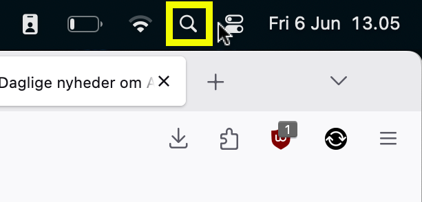

## Øvelse: Installation af Java Development Kit

For at udvikle og køre Java-programmer, skal vi have installeret nogle værktøjer på vores computer.

1. Gå til [https://adoptium.net/](https://adoptium.net/) og download **Java JDK 21**
2. Klik på "Other Downloads"
    
3. Klik på fanen **JDK 21**
4. Vælg den version der passer til dit operativsystem (Windows, macOS, Linux)
5. Åbn den downloadede fil for at starte installationen

Notes:
- JDK står for Java Development Kit, altså alt det vi skal bruge som Java-udviklere
- Er du ferm med at installere software med homebrew på Mac eller Winget på Windows eller apt-get på Linux, kan du også bruge det til at installere JDK 21.
- homebrew: `brew install --cask temurin@21`
- Winget: `winget install EclipseAdoptium.TemurinJDK.21`
- apt-get: `sudo apt-get install openjdk-21-jdk`

--

## Kør installeren
Den stiller ingen vigtige spørgsmål, så bare Continue, Next, Agree osv.


## Tjek installationen
Når installationen er færdig, skal vi sikre os, at Java er korrekt installeret. Det gør vi ved at åbne en **konsolapplikation** og køre en kommando.

- macOS-brugere skal åbne **Terminal** (se næste side)
- Windows-brugere skal åbne **PowerShell** (se to sider frem)

---

### macOS: find Terminal i Spotlight

- Klik på **forstørrelsesglasset** øverst til højre på skærmen
    
- Skriv "Terminal" i søgefeltet og tryk **Enter**
    
- Skriv `java -version` og tryk **Enter**.
- Tjek at du får en besked, der ligner denne:
    
- Tjek at der står **version 21**, hvilket betyder at du har installeret Java JDK 21.
- Hvis du får en fejl, så prøv at genstarte din computer og kør kommandoen igen.
- Stadig har problemer? Spørg dine klassekammerater eller underviseren om hjælp.

---

### Windows: find PowerShell i Start-menuen

- Klik på **Start-menuen** i nederste venstre hjørne af skærmen
- Skriv "PowerShell" i søgefeltet og tryk **Enter**
    
- Skriv `java -version` og tryk **Enter**.
- Tjek at du får en besked, der ligner denne:
    
- Tjek at der står **version 21**, hvilket betyder at du har installeret Java JDK 21.
- Hvis du får en fejl, så prøv at genstarte din computer og kør kommandoen igen.
- Stadig har problemer? Spørg dine klassekammerater eller underviseren om hjælp.

--

# Øvelse: Installering af IntelliJ IDEA

For at få hjælp til at skrive Java-kode, skal vi installere et udviklingsmiljø, der hedder **IntelliJ IDEA**. Det er et program, der hjælper os med at skrive, organisere og køre vores Java-kode.

- Gå til [https://www.jetbrains.com/idea/download/](https://www.jetbrains.com/idea/download/)
- Download **ikke** IntelliJ IDEA **Ultimate**
- **Scroll** ned til IntelliJ IDEA **Community Edition**
    
- Klik "Download"

## Installér

- Åbn den downloadede fil for at starte installationen
- Følg installationsvejledningen og klik "Next", "Continue", o.lign. indtil installationen er færdig

## Start IntelliJ IDEA

- Start IntelliJ IDEA
- Find den i Start-menuen (Windows) eller i Spotlight (macOS)
- Hvis du bliver spurgt om at importere indstillinger, så vælg **Do not import settings**

---

## Opsætning af IntelliJ IDEA

- Vi skal konfigurere IntelliJ IDEA, så den passer til vores behov

- Al konfiguration foregår i **Settings** vinduet
- I vinduet finde og klikke på **Settings** i menuen
- I Windows er det under **File** → **Settings**
- I macOS er det i topmenuen under **IntelliJ IDEA** → **Preferences**
    

--

- I venstre sidepanel, klik på **Plugins**
- Scroll ned til du finder **Local AI/ML Tools**
- Klik på **Disable all**
- Klik på **Ok** for at gemme ændringerne
- Måske skal du genstarte IntelliJ IDEA for at ændringerne træder i kraft
- Gå tilbage til **Plugins** og scroll ned for at sikre dig at **Local AI/ML Tools** er deaktiveret, som her:


--

- I venstre sidepanel, klik på **Editor** → **General** → **Code Folding**
- Scroll ned til du finder **Java**
- Fjern alle flueben under **Java**, så det ligner billedet herunder
- Dette deaktiverer sammenfoldning af kode, der kan skjule kode og skabe forvirring
- Klik på **Ok** for at gemme ændringerne


--

- I venstre sidepanel, klik på **Editor** → **Inlay Hints**
- Fjern fluebenet ved **Code Vision** og **Parameter hints**, så det ligner billedet herunder
- Dette deaktiverer ekstra informationer i koden, som kan være forstyrrende for begyndere
- Klik på **Ok** for at gemme ændringerne


--

- I venstre sidepanel, klik på **Version Control** → **Commit**
- **Sæt flueben** ved **Clear initial commit message**
- **Fjern flueben** i alle bokse under **Commit Checks**, **Advaced Commit Checks**, samt i **Run advanced checks after a commit is done**
- Klik på **Ok** for at gemme ændringerne, hvis et ser ud som billedet herunder


## 🎉
Yay! Nu er IntelliJ IDEA klar til brug!

--

# Øvelse - Nyt projekt i IntelliJ

1. Når du starter på en øvelse skal du oprette et **nyt projekt** i Intellij. _Projektet_ er en **mappe** IntelliJ gemmer på din computer, hvori IntelliJ vil lægge alle de Java-kode filer som hører til projektet. 
2. Klik på **New Project** (Har du allerede et projekt åbent, så luk dette først)


--

3. I det nye vindues - klik på **Java**
    - Udfyld **Name** med `my-first-project`
    - Tjek ud for **JDK**, at vi har valgt en `JDK 21`, dvs. der bør stå noget med `21`, fx `Eclipse Temurin 21...`
    - Tjek at **Build system** er `IntelliJ`
    - At der er flueben i **Add sample code**
    - Klik **Create**


--

4. Her er dit nye Java-projekt i IntelliJ `my-first-project`
5. I venstre sidepanel ser du mappen `my-first-project`. Læg mærke til at der inde i `my-first-project`-mappen ligger en mappe `src`.
5. Fordi du satte flueben i **Add sample code** ligger der allerede en Java-fil `Main` inde i `src`. Når du klikker på `Main` vil den blive åbnet i højre sidepanel, hvis ikke allerede den er det. Det er standard i Java, at lægge sine Java-filer (ligesom `Main`) i `src`. 
6. Læg mærke til, at du i fanen til højre, kan se filnavnet på den åbne fil `Main.java`. Fil-endelsen `.java` fortæller os at filen indeholder Java kildekode, ligesom `.xlsx` indeholder et Excel-regneark.
7. Tag et kig på koden i `Main.java`. Det er ok, at du ikke forstår det. Men kan du få øje på linjen `public static void main(String[] args)` - som vi kalder `main`-metoden? IntelliJ leder også eftet `main`-metoden i dine Java-filer. Hvis filen du har åben har en `main`-metode linje, kommer **en grøn ▷**  til syne i højre hjørne af panelet.
8. Klik på den **den grønne ▷**.


--

9. Nu åbnes et nyt panel i bunden - **konsollen** (eng. console). Læg mærke til, at de tekster der står efter `System.out.println` i koden, er det der dukker op i konsollen.


10. Luk projektet i **File** -> **Close project**
11. Nu er du tilbage i Welcome... vinduet og klar til igen at åbne eller oprette et nyt projekt.

---

# Øvelse - Hello World

1. Lav et nyt Java-projekt i IntelliJ, som du 
    -   navngiver `helloworld`
    -   som Buildsystem vælger du `IntelliJ`
    -   som JDK vælger du `21`
    -   fjern fluebenet i **Add sample code**
2. Under `Project` i venstre sidepanel, højreklik på `src` og vælg `New` → `Java Class`
3. Navngiv klassen `HelloWorld`
4. Udfyld klassen, så den ligner dette:
    ```java
    public class HelloWorld {
        public static void main(String[] args) {
            System.out.println("Hello, World!");
        }
    }
    ```
5. Kør programmet for at se outputtet - skriver programmet "Hello, World!" i konsollen?
6. Sæt `//` foran `System.out.println("Hello, World!");` - så den bliver til en kommentar, så det ligner dette:
    ```java
    public class HelloWorld {
        public static void main(String[] args) {
            // System.out.println("Hello, World!");
        }
    }
    ```
7. Kør programmet igen - hvad sker der?
8. Fjern kommentaren og kør programmet igen - hvad sker der nu?

---

# Øvelse - Syntax highlighting

Måske har du lagt mærke til at IntelliJ farver din kode, så den er lettere at læse - det kaldes **syntax highlighting**. Ligesom indrykning, så forbedrer syntax highlighting læsbarheden af din kode - vi kan bedre se hvilke ord der har en særlig betydning i Java.

1. Fortsæt med at arbejde i dit `helloworld` projekt
2. Prøv at **copy-paste** hele `helloworld` koden du har skrevet før til et alm. tekstbehandlingsprogram (fx Notepad i Windows - eller Notes på Mac)
3. Hvad sker der? - er der stadig farver i koden?
4. Så det er altså IntelliJ der farver koden - det er ikke en del af Java-koden - Java-koden er ren tekst.
5. Læg mærke til hvilke ord der er farvet - de ord har en særlig betydning i Java
6. Prøv at ændre `class` til `klasse` - hvad sker der, hvilken farve får det - kan det stadig køre? 
7. `class` er ligesom `public`, `static`, `void` og flere andre ord **reservede ord** i Java, som har en særlig betydning der hvor vi har brugt det, så vi kan ikke bare ændre det til et andet ord

---

# Øvelse - Udskriv din egen besked

1. Lav et nyt Java-projekt i IntelliJ, som du 
    -   navngiver `helloagainworld`
    -   som Buildsystem vælger du `IntelliJ`
    -   som JDK vælger du `21`

2. Under `Project` i venstre sidepanel, højreklik på `src` og vælg `New` → `Java Class`
3. Navngiv klassen `HelloAgainWorld`
4. Tilføj en `main` metode så det ligner dette:
    ```java
    public class HelloAgainWorld {
        public static void main(String[] args) {
            
        }
    }
    ```
5. Indtast følgende kode i `main` metoden:
    ```java
    System.out.println("Hello Again, World!");
    ```
6. Tjek at din kode ligner dette:
    ```java
    public class HelloAgainWorld {
        public static void main(String[] args) {
            System.out.println("Hello Again, World!");
        }
    }
    ```
5. Kør programmet for at se outputtet - skriver programmet "Hello Again, World!" i konsollen?

--

6. Skriv en ny linje i `main` metoden, der bruger `System.out.println` til at udskrive en besked - vælg selv en besked. 
    ```java
    public class HelloAgainWorld {
        public static void main(String[] args) {
            System.out.println("Hello Again, World!");
            System.out.println("I am learning Java!");
        }
    }
    ```
7. Kør programmet igen - hvad sker der?

---

# Øvelse - Indrykning og mellemrum (whitespaces)
- Når vi programmerer bruger vi indrykning for at gøre vores kode mere læsbar
- Indrykning hjælper os med at se hvilke linjer der hører sammen
- Er Java ligeglad med indrykning? - lad os undersøge det!

1. Fortsæt med at arbejde i dit `helloagainworld` projekt
2. Prøv at fjerne indrykningen i din kode, så den ligner dette:
    ```java
    public class HelloAgainWorld {
    public static void main(String[] args) {
    System.out.println("Hello Again, World!");
    System.out.println("I am learning Java!");
    }
    }
    ```
3. Kør programmet - hvad sker der?
4. Hvorfor er det vigtigt at have indrykning i din kode?
5. Brug **tabulator**-tasten (⇥) for at indrykke koden igen, så den ligner dette:
    ```java
    public class HelloAgainWorld {
        public static void main(String[] args) {
            System.out.println("Hello Again, World!");
            System.out.println("I am learning Java!");
        }
    }
    ```
6. Kør programmet igen - alt ok?
7. Ok, så indrykning er ikke vigtigt for at Java kan forstå koden
---

# Øvelse - andre mellemrum (whitespaces)
- Vi har set at indrykning ikke er vigtigt for at Java kan forstå vores kode
- Hvad med andre mellemrum (whitespaces) - er de vigtige? - lad os undersøge det!

1. Fortsæt med at arbejde i dit `helloagainworld` projekt
2. Prøv nu at eksperimentere fjerne andre mellemrum, fx alle mellemrum omkring `{` og `}` og efter `;`, så det ligner dette:
    ```java
    public class HelloAgainWorld{public static void main(String[] args){System.out.println("Hello Again, World!");...}}
    ```
3. Ok, så Java er tilsyneladede også ligeglad med de mellemrum og linjeskift vi lige har fjernet.
4. Hvorfor synes du ikke vi skal have hele vores kode på en linje?
5. Sæt din **markør** (cursor) på linjen og tryk på 
    - **Ctrl + Alt + L** hvis du er på **Windows** (først Ctrl, så Alt, så L)
    - **Cmd + Option + L** hvis du er på **Mac** for at formattere koden (først Cmd, så Option, så L)
6. Snedigt ikke? - IntelliJ formatterer din kode automatisk, så den bliver mere læsbar
7. Kør programmet igen - alt ok?
8. Prøv at fjerne **alle** mellemrum i din kode, så den ligner dette:
    ```java
    publicclassHelloAgainWorld{publicstaticvoidmain(String[]args){System.out.println("HelloAgain,World!");System.out.println("IamlearningJava!");}}
    ```
8. Kør programmet - hvad sker der? 
9. Læg mærke til at IntelliJ ikke lægere tilføjer syntax highlighting - det er fordi det ikke længere følger Java's syntaksregler,  og IntelliJ kan derfor ikke forstå koden.
10. Ok, så Java er ikke _helt_ ligeglad med mellemrum - hvordan skulle den - hvordan skal man kende forskel på `public`, `class` og `publicclass` hvis de ikke er adskilt af mellemrum?
11. Prøv at formattere koden igen med **Ctrl + Alt + L** (Windows) eller **Cmd + Option + L** (Mac) - hvad sker der?
12. Ok, så IntelliJ kan kun formattere koden, hvis den kan forstå den - og det kan den ikke når vi har "ødelagt" den ved at fjerne alle mellemrum
13. Tilføj mellemrum indtil du igen kan formattere koden igen, så den ligner dette:
    ```java
    public class HelloAgainWorld {
        public static void main(String[] args) {
            System.out.println("Hello Again, World!");
            System.out.println("I am learning Java!");
        }
    }
    ```
---

# Øvelse - Fuld af fejl

1. Fortsæt med at arbejde i dit `helloagainworld` projekt
2. Prøv at fjerne `;` fra slutningen af linjen `System.out.println("Hello, World!");`
3. Kør programmet - hvilken fejl får du fra compileren i IntelliJ?
4. Hvad betyder fejlen?
5. Ret fejlen (tilføj `;` igen) og tjek at programmet kører igen

På samme måde som før, prøv at 

- lave følgende ændringer i din kode, 
- compiler/kør - hvilken fejl får du?
- diskuter evt. med din makker hvad fejlen betyder
- ret fejlen og compiler/kør programmet igen

for hver af de følgende ændringer:

1. Fjern en af `{`'erne i din kode
2. Fjern en af `}`'erne i din kode
3. Skriv `mian` i stedet for `main`
4. Fjern ordet `static`
5. Fjern ordet `public` før `static`
6. Fjern ordet `System.`
7. Udskift `prinln` med `Println`
8. Udskift `println` med `print`