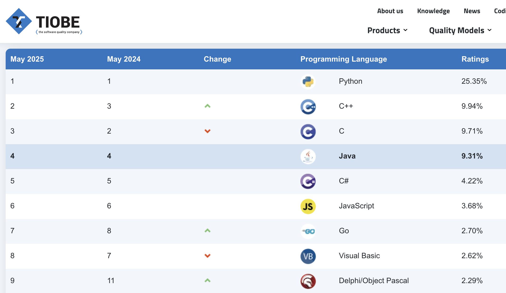
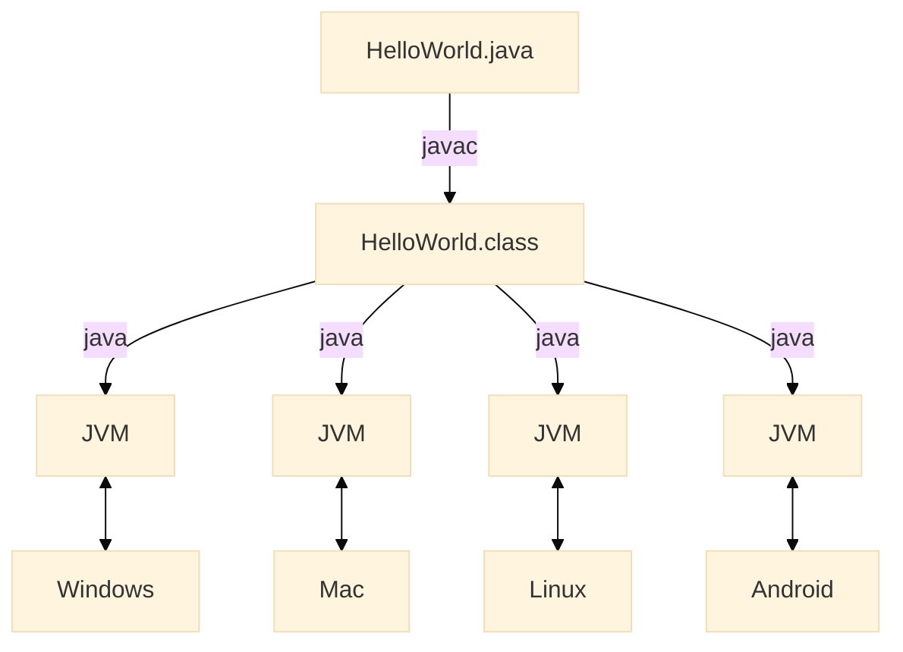

<!-- .slide: class="kea-red" -->

# Introduktion til kurset

---
<!-- .slide: class="kea-dark" -->

## Program

- 08:30 Praktisk information  
- 09:00 Installering af Java og IntelliJ  
- 10:00 Pause  
- 10:15 Første program  
- 11:30 Opsamling  

---
<!-- .slide: class="kea-purple" -->

# Praktisk information

---

# Hvad er Java?

--

Du kan løse problemer ude i virkeligheden

Notes:
- At skrive software er fedt

--

> Hvilke problemer løser vi med software i dag, som tidligere var "bøvlet"

Notes:
- Studende: Nævn eksempler på programmer, der løser et problem, som var vanskeligt at løse uden computer
- Eksempler:
    - bankkonti (Du skal ikke i bank hver gang du vil se din saldo)
    - kreditkort (Du behøver ikke at have kontanter på dig hele tiden) 
    - Excel regneark
    - tekstbehandling (på en skrivemaskine var det svært at rette tastefejl)
    - billedredigering (tidligere måtte du vente på at filmen var fremkaldt)
    - VST instrumenter (du kan ikke have et rigtigt trommesæt i din lejlighed)
    - Reservationssystemer (SAS blev førende, da de fik et reservationssystem, fordi man kunne ringe og booke en plads på et fly næste dag)
    - GPS og Google Maps
    - Streaming (Du kan have alle dine film og musik på din telefon)
    - Sociale medier (Du kan holde kontakt med venner og familie uden at skulle ringe eller skrive breve)

--

**Programmeringssprog** er sprog, vi kan bruge til at skrive programmer

--

**Java** er et meget populært programmeringssprog



--

Java er et **general purpose programmeringssprog**

###Notes:
- du kan løse mange forskellige opgaver med det
    - apps
    - hjemmesider
    - spil
- modsat domæne specifikke sprog, der kun bruges til én ting
- f.eks. SQL, der kun bruges til at spørge databaser
- f.eks. HTML og CSS, der kun bruges til at lave hjemmesider
- f.eks. Scratch, der kun bruges til at lave spil

--

<!-- .slide: data-background-image="images/minecraft.png" -->

--

Java kan køre på mange **forskellige platforme**
- Windows
- Mac
- Linux
- Android

Notes:
- et andet ord for platform er styresystem
- det er det, der gør at Java er så populært
- nogle har måske hørt om "write once, run anywhere"


--



Notes:

- Du skal ikke skrive din kode om for at køre den på en anden platform
- Mennesker skriver kildekode i en tekstfil med endelsen `.java`
- Du kompilerer den til byte-code, som er en binær fil med endelsen `.class`
- Nu kan ingen læse din kildekode
- Et opertivsystem forstår maskinkode
- Når du installerer Java, kører der en Java Virtuel Machine (JVM)
- JVM forstår byte-code og omsætter det til maskinkode
--


<!-- .slide: class="kea-green" -->
## Din tur

--
<!-- .slide: class="kea-green" -->

1. Lav en fil der hedder `HelloWorld.java`  
2. Skriv følgende kode i filen og gem den:  
```java
public class HelloWorld {
    public static void main(String[] args) {
        System.out.println("Hello, World!");
    }
}
```

--
<!-- .slide: class="kea-green" -->

3. Compile med
```bash
javac 
```

--


--
## Kompilering til bytecode

Compileren `javac` oversætter kildekode `HelloWorld.java` til bytecode `HelloWorld.class`

```bash
javac HelloWorld.java
```
Notes:
- javac er Java compiler


## Java bytecode

er en binær fil, der ender på `.class`

Notes:
- binær fil = 0'er og 1'er
- det er til computeren
- det er det, der bliver genereret når vi kompilerer vores kildekode
- det er det, der bliver kørt af Java Virtual Machine (JVM)
- det er det, der gør at Java kan køre på mange forskellige platforme


---

instruktioner til computeren om hvad den skal gøre

---


