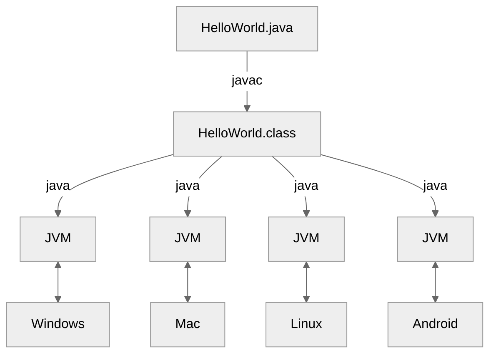

<!-- .slide: class="kea-red" -->

# Introduktion til kurset

---
<!-- .slide: class="kea-dark" -->

## Program

- 08:30 Praktisk information  
- 09:00 Installering af Java og IntelliJ  
- 10:00 Pause  
- 10:15 Første program  
- 11:30 Opsamling  

---
<!-- .slide: class="kea-purple" -->

# Praktisk information

---

# Hvad er Java?

--

## Programmeringssprog

Computere kan løse opgaver for os

--

Vi kan skrive **programmer**, dvs. give computernen instruktioner og data

--

**Programmeringssprog** er sprog, vi kan bruge til at skrive programmer

--

**Java** er et meget populært programmeringssprog


--

Java er et **general purpose programmeringssprog**

###Notes:
- du kan løse mange forskellige opgaver med det
    - apps
    - hjemmesider
    - spil
- modsat domæne specifikke sprog, der kun bruges til én ting
- f.eks. SQL, der kun bruges til at spørge databaser
- f.eks. HTML og CSS, der kun bruges til at lave hjemmesider
- f.eks. Scratch, der kun bruges til at lave spil

--

<!-- .slide: data-background-image="images/minecraft.png" -->

--

Java kan køre på mange **forskellige platforme**
- Windows
- Mac
- Linux
- Android

--


---

## Java kildekode

er en tekstfil, der ender på `.java`

Notes:
- det er til mennesker
- du kan åbne den i en teksteditor
- det er nemmere at bruge IntelliJ
- IntelliJ er en IDE (Integrated Development Environment)
- det er et program, der hjælper os med at skrive kode


--
<!-- .slide: class="kea-green" -->
## Din tur

1. Lav en fil der hedder `HelloWorld.java`  
2. Skriv følgende kode i filen og gem den:  
```java
public class HelloWorld {
    public static void main(String[] args) {
        System.out.println("Hello, World!");
    }
}
```

--
## Kompilering til bytecode

Compileren `javac` oversætter kildekode `HelloWorld.java` til bytecode `HelloWorld.class`

```bash
javac HelloWorld.java
```
Notes:
- javac er Java compiler


## Java bytecode

er en binær fil, der ender på `.class`

Notes:
- binær fil = 0'er og 1'er
- det er til computeren
- det er det, der bliver genereret når vi kompilerer vores kildekode
- det er det, der bliver kørt af Java Virtual Machine (JVM)
- det er det, der gør at Java kan køre på mange forskellige platforme


---

instruktioner til computeren om hvad den skal gøre

---


