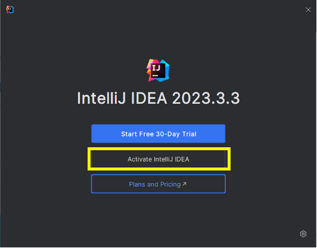

<!-- .slide: class="kea-red" -->
# Installering af udviklingsværktøjer

--
<!-- .slide: class="kea-dark" -->

## Opgaver

- Installér Java Development Kit (JDK)
- Installer IntelliJ IDEA editoren

---

## Øvelse: Installation af Java Development Kit

For at udvikle og køre Java-programmer, skal vi have installeret nogle værktøjer på vores computer.

--

- Gå til [https://adoptium.net/](https://adoptium.net/) og download **Java JDK 21**
- Klik på "Other Downloads"

-- 
# Download Java JDK 21

1. Klik på fanen **JDK 21**
2. Vælg den version der passer til dit operativsystem (Windows, macOS, Linux)
3. Åbn den downloadede fil for at starte installationen

Notes:
- JDK står for Java Development Kit, altså alt det vi skal bruge som Java-udviklere
- Er du ferm med at installere software med homebrew på Mac eller Winget på Windows eller apt-get på Linux, kan du også bruge det til at installere JDK 21.
- homebrew: `brew install --cask temurin@21`
- Winget: `winget install EclipseAdoptium.TemurinJDK.21`
- apt-get: `sudo apt-get install openjdk-21-jdk`

--

# Kør installeren
Den stiller ingen vigtige spørgsmål, så bare Continue, Next, Agree osv.

---

# Tjek installationen
Når installationen er færdig, skal vi sikre os, at Java er korrekt installeret. Det gør vi ved at åbne en **konsolapplikation** og køre en kommando.

- macOS-brugere skal åbne **Terminal** (se næste side)
- Windows-brugere skal åbne **PowerShell** (se to sider frem)

--

# macOS: find Terminal i Spotlight

- Klik på **forstørrelsesglasset** øverst til højre på skærmen
    
- Skriv "Terminal" i søgefeltet og tryk **Enter**
    

--

# Windows: find PowerShell i Start-menuen

- Klik på **Start-menuen** i nederste venstre hjørne af skærmen
- Skriv "PowerShell" i søgefeltet og tryk **Enter**
    

--

- Skriv `java -version` og tryk **Enter**.
- Tjek at du får en besked, der ligner denne:
    
- Tjek at der står **version 21**, hvilket betyder at du har installeret Java JDK 21.
- Hvis du får en fejl, så prøv at genstarte din computer og kør kommandoen igen.
- Stadig har problemer? Spørg dine klassekammerater eller underviseren om hjælp.

---

# Øvelse: Installering af IntelliJ IDEA

Fordi du har en **@stud.kea.dk** mailadresse, kan du få en **gratis licens** til IntelliJ IDEA **Ultimate**.

--

## Download

- Gå til [https://www.jetbrains.com/idea/download/](https://www.jetbrains.com/idea/download/)
- Klik "Download"

--

## Installér

- Åbn den downloadede fil for at starte installationen
- Sæt flueben, som herunder (hvis du er på Windows)
    

--

## Aktivér din licens
- Start IntelliJ IDEA
- Vælg "Activate" i velkomstvinduet

- Vælg "