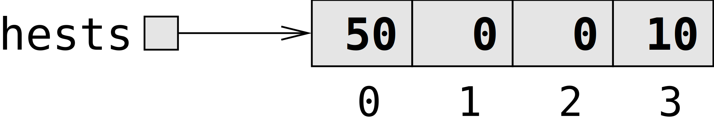
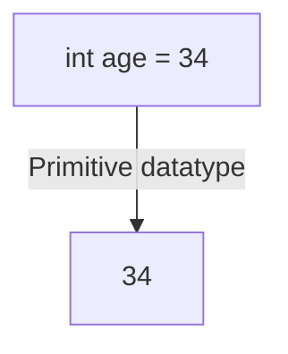

<!-- .slide: class="ek-academic-fire" -->

# Arrays og referencer

---
<!-- .slide: class="k-sunlit-energy" -->

## Program

- 08:30 Array og referencer
- 09:00 Øvelser  
- 10:00 Pause  
- 10:15 Vi fortsætter med øvelser  
- 11:30 Opsamling  

---

# Arrays

--

Spørg din sidemakker:
*Hvorfor bruger vi variable?*

Notes:
- Spørgsmål til klassen
- Vi bruger variable til at gemme data, så vi kan bruge det senere i programmet.
- Det gør vores kode mere læsbar og lettere at vedligeholde.

--

```java
int coins;
coins = 50;
```

Notes:
- Indtil nu har vi arbejdet med variable, som gemmer en enkelt værdi.
- Vi kan give den et navn og bruge den andre steder i programmet.
- For eksempel, bruger vi her en `int` variabel `coins` til at gemme antallet af guld-mønter, som vi har i vores skattekiste
- Men, nogle gange har vi brug for at gemme en række værdier i én variabel, fx en liste af tal eller en tekststreng. I Java kan vi bruge arrays til at gemme flere værdier af samme type.

--


```java
int[4] chests;
```

--

```java
int[4] chests;
```


Notes:
- Her har vi en array, der repræsenterer fire kister, hvori vi kan gemme guldmønter.
- En array er en samling af værdier, der alle har samme datatype.
- Bemærk at vi bruger `[]` for at angive, at det er en array.

--

Piraten gemmer 50 mønter i den **første** kiste.

```java
int[] chests = new int[4];
chests[0] = 50;
```

Notes:
- For at gemme en værdi i en array, bruger vi indekset, som starter fra 0.
- Her gemmer vi 50 mønter i den første kiste, som er `chests[0]`.

--


```java
int[] chests = new int[4];
chests[0] = 50;
```

--

Lad os gemme 10 mønter i den sidste kiste. 

```java
chests[???] = 10;
``` 

Notes:
- Hvad er indekset for den sidste kiste?

--



```java
int[] chests = new int[4];
chests[0] = 50;
chests[3] = 10;
```

--

```java
int[] chests = {50, 0, 0, 10};
```

Notes:
- Vi kan initialisere en array med værdier direkte, uden at skulle sætte dem én ad gangen.
- Her har vi initialiseret `chests` med 50 mønter i den første kiste, 0 i de to midterste kister og 10 mønter i den sidste kiste.

--

Vi kan tilgå værdierne i array'et ved at bruge indekset.

Spørgsmål: *Hvilket indeks har den anden kiste?*

Notes:
- For at få adgang til værdierne i en array, bruger vi indekset.
- Husk at indekset starter fra 0, så den anden kiste er `chests[1]`.

--

```java
int[] chests = {50, 0, 0, 10};
int secondChest = chests[1]; // 0
```

Notes:
- Vi kigger i den anden kiste, som er `chests[1]`
- Hvor mange mønter er der i den anden kiste?
- Vi gemmer værdien i `secondChest`

--

Vi kan fjerne 20 mønter fra den første kiste.

```java
chests[0] = chests[0] - 20; // 30
````

--

Alternativt, med `-=`

```java
chests[0] -= 20; // 30
```

---

# Primitive datatyper vs. reference datatyper

--

```java
int age = 34;
String name = "Alice";
```

Notes: 
- Vi har tidligere talt om at variable er en måde at gemme data på.
- Vi har anvendt variable med forskellige datatyper, som fx `int`, `double`, `char` og `String`
- Vi har brugt `int`, `double`, `char` og `String` som datatyper.

--

```java
int age = 34;          // en primitive datatype
String name = "Alice"; // en reference datatype
```

Notes:

- Måske har I bemærket at String er anderledes end de andre datatyper?
- Der er forskellige typer af datatyper i Java:
  - **Primitive datatyper**: Disse gemmer en enkelt værdi, fx `int`, `double`, `char`.
  - **Reference datatyper**: Disse gemmer en reference til et objekt, fx `String`, arrays, objekter.

--



Notes:
- Lad os kigge nærmere på forskellen mellem primitive og reference datatyper.
- **Primitive datatyper** gemmer selve værdien direkte i variablen.


`int temperature = 34;` - **Primitive datatyper** (fx `int`, `double`, `char`)


---