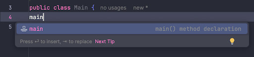
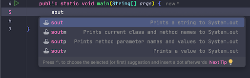

<!-- .slide: class="ek-academic-fire" -->

# Variabler og expressions

---
<!-- .slide: class="k-sunlit-energy" -->

# Program

- 08:30 Variabler og expressions
- 09:30 Igang med øvelser
- 10:00 Pause
- 10:15 Øvelser fortsat
- 11:30 Opsamling, forberedelse til næste gang


---

# Et program er en **opskrift**

--

## Omelet

1. 2 æg slås ud i en skål
2. 2 æg piskes sammen
3. Mælk tilsættes
4. Salt tilsættes
5. Steg omeletten på panden

Notes:

- En opskrift er en liste af **trin** der skal følges i rækkefølge
- Computeren læser opskriften og udfører den trin for trin

--
<!-- .slide: class="k-daylight" -->
## Demo - Omelet opskrift

Notes:

```java
public class Main {
    // Opskrift på omelet til 1 person
    public static void main(String[] args) {
        System.out.println("2 æg slås ud i en skål");
        System.out.println("2 æg piskes sammen");
        System.out.println("Mælk tilsættes");
        System.out.println("Salt tilsættes");
        // System.out.println("Chili tilsættes");
        System.out.println("Steg på en pande"); // evt. i smør
    }
}
```

- Lad os lave et program, der skriver hvert trin i opskriften ud på skærmen.
- Hver linje bliver udført i rækkefølge
- `System.out.println()` er en metode, der skriver tekst ud på skærmen
- Linjerne der starter med `//` eller `/*` er kommentarer, som ikke bliver udført af programmet
- Kommentarer er gode til at forklare hvad koden gør

---

## Statements og kommentarer

--

Linjen `System.out.println("Steg på en pande");` er et **statement**

--

Et statement er en **instruktion** som computeren skal udføre

--

I Java slutter statements med et `;`

--

`// System.out.println("Chili tilsættes");` er en **kommentar**

Notes:
- De starter med `//` og slutter ved slutningen af linjen

--

En kommentar er bliver **ignoreret** af computeren


Notes:

- Kommentarer er ikke statements, de bliver ikke udført af computeren
--

Kommentarer er gode til at forklare hvad koden gør, fx

```java
// Opskrift på omelet til 1 person
```

--

Vi kan også bruge kommentarer til at **"slå" en linje fra**, så den **ikke bliver udført**

```java
// System.out.println("Chili tilsættes");
```

--  

Hvis vi vil have chili i omeletten, kan vi bare fjerne `//` fra linjen

```java
public class Main {
    // Opskrift på omelet til 1 person
    public static void main(String[] args) {
        System.out.println("2 æg slås ud i en skål");
        System.out.println("2 æg piskes sammen");
        System.out.println("Mælk tilsættes");
        System.out.println("Salt tilsættes");
        System.out.println("Chili tilsættes");
        System.out.println("Steg på en pande"); // evt. i smør
    }
}
```

---

# Variabler og expressions

--
<!-- .slide: class="k-daylight" -->
## Demo - Omelet til et antal personer

Notes:
```java
public class Main {
    public static void main(String[] args) {
        // Ingredienser til omelet til 1 person
        System.out.println("Ingredienser:");
        System.out.println("æg (stk): 2");
        System.out.println("mælk");
        System.out.println("salt");
        // Opskrift på omelet til 1 person
        System.out.println("2 æg slås ud i en skål");
        System.out.println("2 æg piskes sammen");
        System.out.println("Mælk tilsættes");
        System.out.println("Salt tilsættes");
        System.out.println("Steg omeletten på panden");
    }
}
```

- Lad os lave en ingrediensliste til omeletten
- Til en omelet til 1 person skal vi bruge 2 æg, mælk og 0.5 teskefuld salt
- Skal jeg gentage det for at 2 personer? 3 personer? 4 personer?
- Det er kedeligt at skrive det igen og igen
- DRY (Don't Repeat Yourself)
- Vi kan bruge **variabler** til at gemme værdierne, så vi kan bruge dem flere gange

```java
public class Main {
    public static void main(String[] args) {
        // Ingredienser til omelet til 1 person
        int eggs = 2;
        System.out.println("Ingredienser:");
        System.out.println("æg (stk): " + eggs);
        System.out.println("mælk");
        System.out.println("salt");
        // Opskrift på omelet til 1 person
        System.out.println(eggs + " æg slås ud i en skål");
        System.out.println(eggs + " æg piskes sammen");
        System.out.println("Mælk tilsættes");
        System.out.println("Salt tilsættes");
        System.out.println("Steg omeletten på panden");
    }
}
```

--

En variabel er...

--

**en "boks"** i computerens hukommelse, hvor du kan **gemme data**


--

Du kan give boksen et **navn** fx `eggs`, så du kan bruge den senere

--

**Navngivning** er vigtigt

--

Hvad betyder `int e = 2`?

--

Bedre: `int numberOfEggs = 2`

--

Java er **case-sensitive**

dvs. `numberofeggs` og `numberOfEggs` er to forsk. variable

--

| navn             | ok? |
|------------------|----|
| `eggs`           | ✅  |
| `numberOfEggs`   | ✅  |
| `Eggs`           | ❌  |
| `numberofeggs`   | ❌  |
| `number of eggs` | ❌  |
| `number-of-eggs` | ❌  |
| `e`              | ❌  |
| `hest`           | ❌  |
| `eggs2`          | ❌  |
| `intEggs`        | ❌  |
| `public`         | ❌  |

Notes:

- Er `e` et godt navn til en variabel der indeholder antallet af æg?
- variabelnavne skal ikke indeholde typeinformationer
- `public` er et **reservet ord** i Java, og kan ikke bruges som variabelnavn

--

Variablens **type** skal passe til den **værdi** du vil gemme i den, fx 

| type     | værdi            |
|----------|------------------|
| `int`    | 2                |
| `double`  | 0.5              |
| `bool`   | true             |
| `char`   | 'a'              |
| `String` | "Salt tilsættes" |


Notes:
- `int` for heltal
- `double` for decimaltal
- `char` for bogstaver
- `bool` for sand/falsk
- `String` for tekst

--

### Deklarering af variabel

`int eggs;` kalder vi, at **deklarere** en variabel `eggs` af typen `int`

Notes:

- Læg mærke til at vi ikke har givet den en værdi endnu

--

### Tildeling af værdi

`eggs = 2;` kalder vi, at **tildele** værdien `2` til variablen `eggs`

Notes:
- eggs er nu en boks i hukommelsen, der indeholder værdien 2


--

### Deklarering og tildeling

Vi kan også gøre det under et `int eggs = 2;`

--

Så vores program kan se sådan ud:

```java
public class Main {
    public static void main(String[] args) {
        // Ingredienser til omelet til 1 person
        int eggs = 2;
        System.out.println("Ingredienser:");
        System.out.println("æg (stk): " + eggs);
        System.out.println("mælk");
        System.out.println("salt");
        // Opskrift på omelet til 1 person
        System.out.println(eggs + " æg slås ud i en skål");
        System.out.println(eggs + " æg piskes sammen");
        System.out.println("Mælk tilsættes");
        System.out.println("Salt tilsættes");
        System.out.println("Steg omeletten på panden");
    }
}
```

--

# Heltal

engelsk: `int`eger

```java
int age = 25;
```

--

# Decimaltal

engelsk: `double` precision floating points

```java
double height = 178.2;
```

Notes:
Bemærk engelsk decimal er '.' og ikke ',' som på dansk.

--

# Sand/falsk

engelsk: `bool`ean

```java
bool hasBirthdayToday = false;
```

Notes:
- Opkaldt efter engelsk matematiker George Boole

--

# Bogstav

engelsk: `char`acter

```java
char initial = 'J';
```

--

# Tekst
engelsk: `string`

```java
String name = "Jens";
```

Notes:
- `int`, `double`, `char` og `String` er primitive data typer og skrives med små bogstaver
- `String` er dermiod en klasse (også kaldet reference type) og skrives med stort S
- Faktisk er `String` er en sekvens af bogstaver af primitivtypen `char`

---

# Operators og expressions

--

```java
int eggsPerPerson = 2;
int persons = 4;

int totalEggs = eggsPerPerson * persons;
```

`*` er en **operator**

`eggsPerPerson` og `persons` er **operander**

`eggsPerPerson * persons` er en **expression**

--

## Matematiske operatorer

| operator | betydning      |
|----------|----------------|
| `+`      | addition       |
| `-`      | subtraktion    |
| `*`      | multiplikation |
| `/`      | division       |
| `%`      | modulus        |

--

`+` bruges til at lægge tal sammen, fx

```java
int a = 5;
int b = 3;
int sum = a + b; // 8
````

--

Men `+` bruges også til at **sammenkæde** tekst, fx

```java
String firstName = "Beate";
System.out.println("Mit navn er " + firstName); // Mit navn er Beate
```

--

Vi kunne også skrive

```java
String firstName = "Beate' alder er ";
int age = 55;
String fullName = firstName + age; // Beate' alder er 55
System.out.println(fullName);
```

Det virker selvom `age` er et heltal

--

**operand** `+` **operand**

- Hvis **den ene side er tekst** &rarr; **sammenkædning af tekst**
- Hvis **begge sider er tal** &rarr; **addition af tal**

Notes: 
- I Java er `+`-operatoren **overloaded**
- Den opfører sig forskelligt afhængig af typen af de værdier den arbejder med.

--

Er `-` også overloaded?

```java
String firstName = "Beate";
String lastName = "Hansen";
String fullName = firstName - lastName; // Fejl!
```

**Nej!**

--

## Sammenligningsoperatorer

| operator | betydning      |
|----------|----------------|
| `==`     | er lig med     |
| `!=`     | er ikke lig med |
| `>`      | større end     |
| `<`      | mindre end     |
| `>=`     | større eller lig med |
| `<=`     | mindre eller lig med |

Notes:

- `==` er ikke det samme som `=` (tildelingsoperatoren)
- `==` bruges til at sammenligne værdier
- `=` bruges til at tildele værdier
- `!=` bruges til at tjekke om værdierne ikke er ens
- `>` bruges til at tjekke om værdien til venstre er større end værdien til højre (osv.)

--
<!-- .slide: class="k-daylight" -->
## Demo -  Sammenligningsoperatorer

Notes:

```java
int eggs = 2;
int persons = 4;
int totalEggs = eggs * persons;
bool enoughEggs = eggs >= totalEggs;
System.out.println("Er der nok æg? " + enoughEggs);
```

- `enoughEggs` er en boolsk variabel, der indeholder sand/falsk
- `enoughEggs` er sand hvis der er nok æg til alle personer

--

## Matematik med sand/falsk-værdier

| operator | betydning      |
|----------|----------------|
| `&&`     | og             |
| `\|\|`     | eller          |
| `!`      | ikke           |

(osv.)

Notes:
- `&&` bruges til at tjekke om begge betingelser er sande
- `||` bruges til at tjekke om en af betingelserne er sand
- `!` bruges til at tjekke om betingelsen er falsk

--
<!-- .slide: class="k-daylight" -->
## Demo - Matematik med sand/falsk-værdier

Notes:

```java
...
bool groceryStoreOpen = true;
bool shopEggs = groceryStoreOpen && !enoughEggs;
System.out.println("Skal jeg købe ind? " + shopEggs);
```

--
<!-- .slide: class="k-daylight" -->
## Demo: Variablen kan ændres

Notes: 
- Du kan ændre værdien af en variabel når som helst i programmet
- Du kan også ændre værdien af en variabel flere gange

```java
int eggs = 2;
System.out.println(eggs); // 2

eggs = 4;
System.out.println(eggs); // 4

eggs = eggs + 2;
System.out.println(eggs); // 6
```

## Tildelingsoperator

| operator | betydning          |
|----------|--------------------|
| `=`      | tildel             |
| `+=`     | tilføj og tildel   |
| `-=`     | træk fra og tildel |

(osv.)

--

## Demo: Tildelingsoperator

Notes:

```java
int eggs = 2;
System.out.println(eggs); // 2

eggs += 2;
System.out.println(eggs); // 4

eggs -= 1;
System.out.println(eggs); // 3
```

--

## Unære operatorer

| operator | betydning         |
|----------|-------------------|
| `++`     | `eggs = eggs + 1` |
| `--`     | `eggs = eggs - 1` |

Notes:

- det er en forkortelse for at tilføje eller trække fra 1
- det er praktisk når vi skal tælle op eller ned, fx i en løkke (næste gang)

--

## Demo - Unære operatorer

Notes:

```java
int eggs = 2;
System.out.println(eggs); // 2
eggs++;
System.out.println(eggs); // 3
eggs--;
System.out.println(eggs); // 2
```

--

## Konstanter

```java
final int EGGS_PER_PERSON = 2;
EGGS_PER_PERSON = 20; // Java throws an error!!         
```

Notes:
- En konstant er en variabel, der ikke kan ændres efter den er blevet tildelt en værdi
- final betyder at den ikke kan ændres
- Det er en god idé at bruge konstanter til værdier, der ikke skal ændres, fx pi osv.
- Konstanter skrives med store bogstaver, og ord adskilt med `_` (underscore)

```java
final int MAX_AGE = 100;
final double PI = 3.14;
```

--

## Mere komplekse expressions

```java
result = 3 * 5 / 5 + 1 
// will this java code run??                    
```
--

## Rækkefølge på operations

- **parenteser** (), {}, []
- **eksponenter** x², x³ og **kvadratrødder** √x 
- **multiplikation** * og **division** /  
- **addition** \+ og **subtraktion** −

Notes:
- Rækkefølgen er den samme som i matematik
- Parentheser har højeste prioritet
- Multiplikation og division har højere prioritet end addition og subtraktion

---

# Shortcuts i IntelliJ

--



**main** giver public static void main()

--



**sout** giver System.out.println();

---
<!-- .slide: class="k-sunlit-energy" -->
# Opsamling

- Nævn tre ting du tager med fra i dag