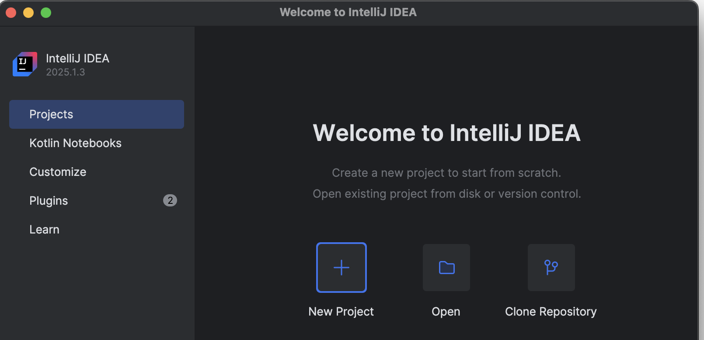
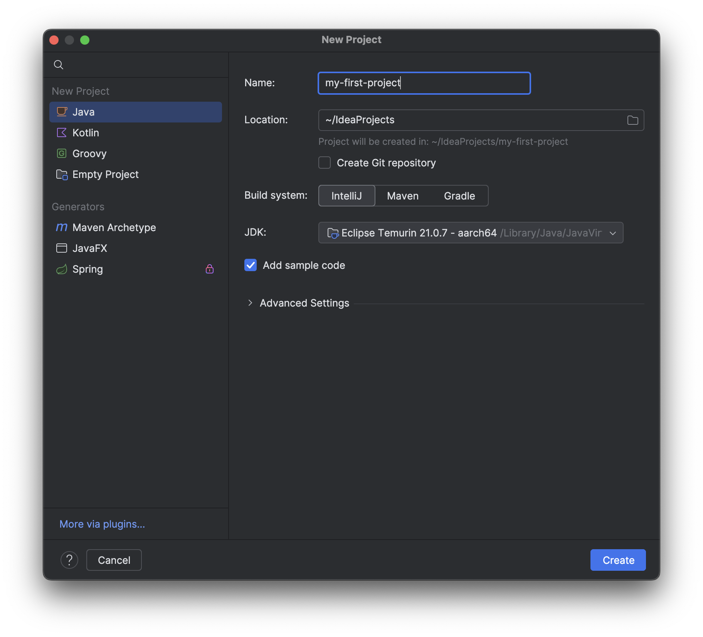
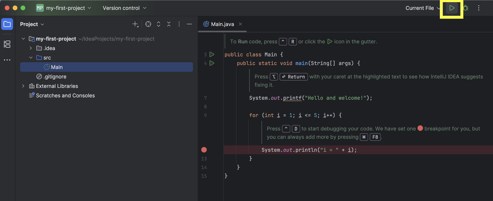
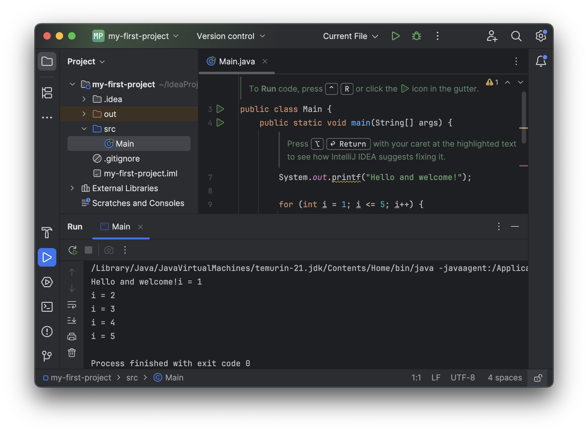

# Nyt projekt i IntelliJ

1. Når du starter på en øvelse skal du oprette et **nyt projekt** i Intellij. _Projektet_ er en **mappe** IntelliJ gemmer på din computer, hvori IntelliJ vil lægge alle de Java-kode filer som hører til projektet. 
2. Klik på **New Project** (Har du allerede et projekt åbent, så luk dette først)

--

3. I det nye vindues - klik på **Java**
    - Udfyld **Name** med `my-first-project`
    - Tjek ud for **JDK**, at vi har valgt en `JDK 21`, dvs. der bør stå noget med `21`, fx `Eclipse Temurin 21...`
    - Tjek at **Build system** er `IntelliJ`
    - At der er flueben i **Add sample code**
    - Klik **Create**

--

4. Her er dit nye Java-projekt i IntelliJ `my-first-project`
5. I venstre sidepanel ser du mappen `my-first-project`. Læg mærke til at der inde i `my-first-project`-mappen ligger en mappe `src`.
5. Fordi du satte flueben i **Add sample code** ligger der allerede en Java-fil `Main` inde i `src`. Når du klikker på `Main` vil den blive åbnet i højre sidepanel, hvis ikke allerede den er det. Det er standard i Java, at lægge sine Java-filer (ligesom `Main`) i `src`. 
6. Læg mærke til, at du i fanen til højre, kan se filnavnet på den åbne fil `Main.java`. Fil-endelsen `.java` fortæller os at filen indeholder Java kildekode, ligesom `.xlsx` indeholder et Excel-regneark.
7. Tag et kig på koden i `Main.java`. Det er ok, at du ikke forstår det. Men kan du få øje på linjen `public static void main(String[] args)` - som vi kalder `main`-metoden? IntelliJ leder også eftet `main`-metoden i dine Java-filer. Hvis filen du har åben har en `main`-metode linje, kommer **en grøn ▷**  til syne i højre hjørne af panelet.
8. Klik på den **den grønne ▷**.

--

9. Nu åbnes et nyt panel i bunden - **konsollen** (eng. console). Læg mærke til, at de tekster der står efter `System.out.println` i koden, er det der dukker op i konsollen.

10. Luk projektet i **File** -> **Close project**
11. Nu er du tilbage i Welcome... vinduet og klar til igen at åbne eller oprette et nyt projekt.