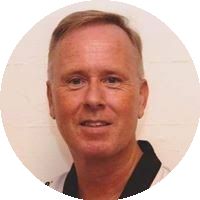
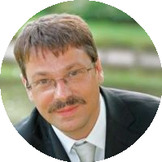
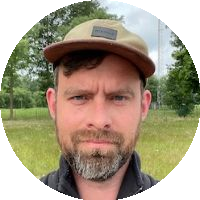
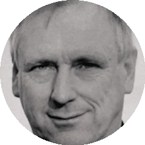
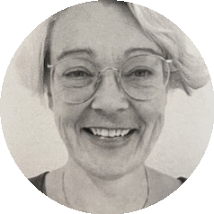
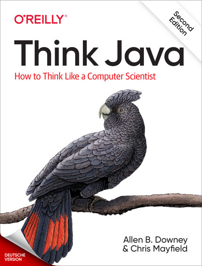
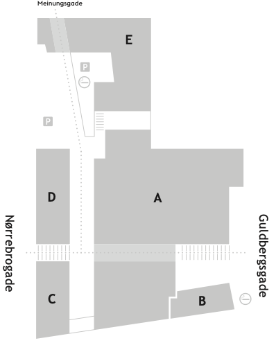
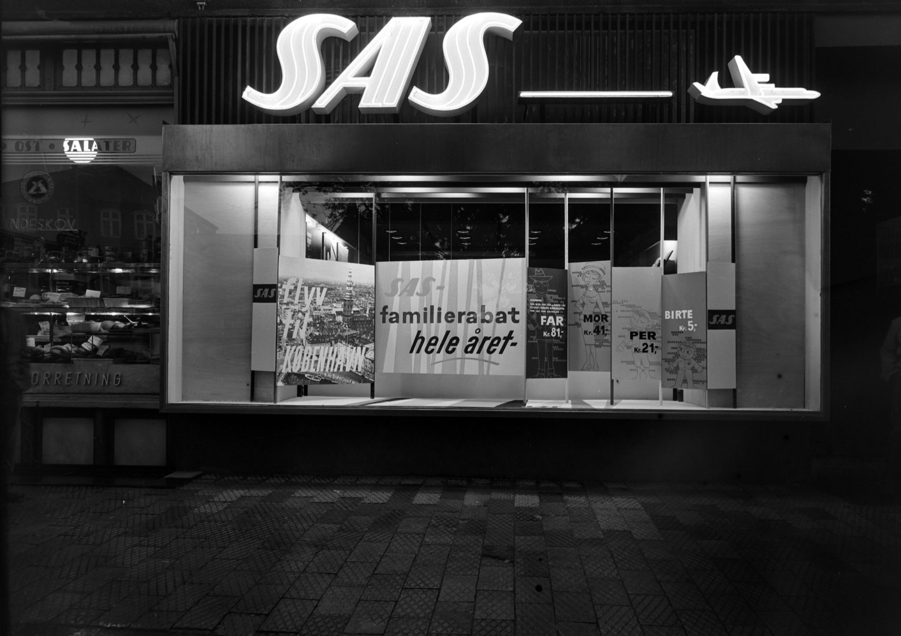

<!-- .slide: class="cover-2" -->
# Introdag 1

> Mens vi venter...
>
> lav et navneskilt
>

Notes:
- Husk A4 papir og tuscher
- Bed de studerende om at lave et navneskilt når de ankommer

---
<!-- .slide: class="o-academic-fire" -->
# Program
- Os og jer
- Studiet
- Find vej på EK
- Hvad laver en datamatiker?
- Rollen som studerende
- Hack dit studieliv

---

<!-- .slide: class="cover-7" -->
# Os og jer

--

Underviser i *Systemudvikling*

## *Cay*

[CAHL@ek.dk](mailto:CAHL@ek.dk)

--

Underviser i *IT- og Forretningsudvikling*

 
## *Oskar*

[OSTU@ek.dk](mailto:OSTU@ek.dk)

--

Underviser i *Programmering*

## *Jakob*

[JANO@ek.dk](mailto:JANO@ek.dk)

--
<!-- .slide: class="cover-15" -->
## Jer

--
<!-- .slide: class="k-patrick-star" -->

- Tag 5 samtale-kort fra bunken heroppe
- Gå rundt i blandt hinanden
- Hils på hinanden med navn og stil et spørgsmål

--

Uddannelseschef på *Datamatiker* (og min chef)

# *Erik Christian Hansen*

... kommer forbi og siger hej i morgen

--

Leder på EK Digital (og min chefs chef)

# *Frederikke*

--

...og rektor på EK

<iframe width="750" height="422" src="https://www.youtube.com/embed/S11quPmFWkk?rel=0&showinfo=0&controls=0&privacy_mode=1" title="Velkommen til EK" frameborder="0" allow="accelerometer; autoplay; clipboard-write; encrypted-media; gyroscope; picture-in-picture; web-share" referrerpolicy="strict-origin-when-cross-origin" allowfullscreen></iframe>

Notes:
- Rektor vil gerne byde jer velkommen til EK

---
<!-- .slide: class="cover-8" -->
# Studiet

--

- 400 studerende
- 25 undervisere
- 5 semestre
- 150 ECTS

--

<table class="education">
<tr>
	<th>1. SEMESTER</th>
	<th>2. SEMESTER</th>
	<th>3. SEMESTER</th>
	<th>4. SEMESTER</th>
	<th>5. SEMESTER</th>
</tr>
<tr>
	<td rowspan="3">PROGRAMMERING 1 (15 ECTS)</td>
	<td rowspan="3">PROGRAMMERING 1 (15 ECTS)</td>
	<td rowspan="2">PROGRAMMERING 2 (10 ECTS)</td>
	<td rowspan="2">VALGFAG 1 (10 ECTS)</td>
	<td style="background-color: #f8edca;" rowspan="3">PRAKTIK (15 ECTS)</td>
</tr>
<tr>
</tr>
<tr>
	<td rowspan="2">SYSTEMUDVIKLING (10 ECTS)</td>
	<td rowspan="2">VALGFAG 2 (10 ECTS)</td>

</tr>
<tr>
	<td rowspan="2">SYSTEMUDVIKLING (10 ECTS)</td>
	<td>SYSTEMUDVIKLING (5 ECTS)</td>
	<td rowspan="3" style="background-color: #f8edca;">AFGANGSPROJEKT (15 ECTS)</td>
</tr>
<tr>
	<td>TEKNOLOGI 1 (5 ECTS)</td>
	<td rowspan="2">TEKNOLOGI 2 (10 ECTS)</td>
	<td rowspan="2">VALGFAG 3 (10 ECTS)</td>
</tr>
<tr>
	<td>IT- OG FORRETNINGS- UDVIKLING (5 ECTS)</td>
	<td>IT- OG FORRETNINGS- UDVIKLING (5 ECTS)</td>
</tr>
</table>

--

8-9 eksamener

--

1. semester
	- Programmering 1 - *Mundtlig eksamen* (15 ECTS)  
2. semester
	- Programmering 1/Systemudvikling 1/IT- og forretn. 1 og Teknologi 1 - *Projekt og mundtlig eksamen* (45 ECTS)
3. semester
	- Programmering 2 - *Mundtlig eksamen* (10 ECTS)
	- Systemudvikling 2 - *Mundtlig eksamen* (10 ECTS)
	- Teknologi 2 - *Mundtlig eksamen* (10 ECTS)
4. semester
	- Valgfag 1 - *Prøve* (10 ECTS)
	- Valgfag 2 - *Prøve* (10 ECTS)
	- Valgfag 3 - *Prøve* (10 ECTS)
5. semester
	- Praktik - *Skriftlig eksamen* (15 ECTS)
	- Afsluttende projekt - *Projekt og mundtlig eksamen* (15 ECTS)
--
#### 1. semester

--

#### Programmering
"Hvordan man bygger software      
\- ved brug af værktøjer og metoder brugt i branchen"

--

#### Systemudvikling
"Alt det der støtter op om selve programmeringen  
– planlægning, design, kvalitetssikring"

--

#### IT- og forretningsudvikling
"Forstå dem der aftager softwaren,  
og betaler os for at lave dem"

--

#### Undervisningen

- Klasseundervisning
- Øvelser
- Problemløsning
- Diskussioner
- Studenter-præsentationer
- Gruppearbejde
- Større projekter med vejledning

--

#### Eksempeluge 1. semester

--

<table class="week">
	<tr>
		<th></th>
		<th>MANDAG</th>
		<th>TIRSDAG</th>
		<th>ONSDAG</th>
		<th>TORSDAG</th>
		<th>FREDAG</th>
	</tr>
	<tr>
		<td>8:30 - 11:45</td>
		<td>PROGRAMMERING</td>
		<td></td>
		<td>PROGRAMMERING</td>
		<td></td>
		<td>IT- og FORRET-NINGSUDVIKLING</td>
	</tr>
	<tr>
		<td>12:30 - 14:00</td>
		<td></td>
		<td>SYSTEMUDVIKLING</td>
		<td></td>
		<td>PROGRAMMERING</td>
		<td></td>
	</tr>
</table>

--
... MEN skemaet kan ændre sig fra uge til uge

Se skemaet på [https://ums.ek.dk/

--

### Undervisningsmateriale

--

2\. udgave - gratis online: [https://greenteapress.com/wp/think-java-2e/](https://greenteapress.com/wp/think-java-2e/)

--

Gratis [LinkedIn Learning](https://www.linkedin.com/learning/) adgang med EK login

---
<!-- .slide: class="cover-1" -->
# Find vej på EK

--

- E: Datamatiker, Code Lab, cafe, studievejledningen
- A: Kantine, servicedesk, biblioteket, cykelparkering
- B: Studenterbaren

Notes:
- Vi er i næsten udelukkende i bygning E
- Kantinen er i bygning A
- Studenterbaren er i bygning B
- Gå ind fra Meinungsgade 8
- Cykelparkering i kælderen
- Ingen bilparkering

--
<!-- .slide: data-background-image="img/meinungsgade.jpg" -->

> Indgang fra Meinungsgade 8

--

#### Adgang med studiekort

Har I fået lavet studiekort?
...ellers [https://ekstudiekort.dk/](https://ekstudiekort.dk/)
--

#### Lokaler

**GBG.E336** betyder:
- Campus GBG, Guldbergsgade
- Bygning E
- 3\. sal
- Lokale 336
--
### Rygepolitik

Notes:
- Rygning er ikke tilladt på hele campus

--

#### Hjertestarter

**2 stk.**

- En i bygning A (ved receptionen)
- En i bygning E (ved lokale E.136)

--

#### Beredskabsplan

[https://mit.ek.dk/media/tdpdp1ub/beredskabsplan-ek-guldbergsgade.pdf](https://mit.ek.dk/media/tdpdp1ub/beredskabsplan-ek-guldbergsgade.pdf)

--

<!-- .slide: class="k-patrick-star" -->
#### Foto orienteringsløb på campus

- 30 min.
- Hold a 2-3 personer
- Besøg hvert sted på kortet
- Find det foto der passer til stedet

---
<!-- .slide: class="cover-5" -->
# Hvad kan en datamatiker?

--
<!-- .slide: data-background-image="img/bedstemor-and.png" -->
> ...hvad du kan sige, når bedstemor spørger, hvad du studerer?
--

#### Da jeg var barn...

Notes:
- Da jeg var barn skulle mine forældre på posthuset for at betale regninger, fx husleje

--

#### Da jeg var barn...

Notes:
- Hvis man bruge et stort beløb kunne man skrive en check, så kunne modtageren indløse den i sin bank.

--

#### Da jeg var barn...

Notes:
- Skulle man købe en rejse, skulle man gå til et rejsebureau.
- Rejsebureauet skulle kontakte flyselskabet for at booke billetter.
- SAS blev markedsleder da de begyndte at tilbyde online booking - et af Danmarks tidligste IT-projekter. De kunne tilbyde en rejse næste dag, hvilket var en kæmpe fordel for businesskunder.

--

#### Da jeg var barn...

--

Digitale produkter løser problemer for mennesker

--

Det danske samfund er i front, når det kommer til digitalisering   
 \- det er en kæmpe effektivitetsgevinst  
 \- mennesker kan brug deres tid på opgaver med mening i
 
--

... alt det kræver **digitale håndværkere** - som jer

--
<!-- .slide: class="k-patrick-star" -->
Brug 7 min til at tænke over:  
\- Hvilke digitale produkter bruger du i din hverdag?  
\- Hvilke problemer løser de for dig?

Notes:
- De der har forslag må gerne sige dem højt
---
<!-- .slide: class="cover-6" -->
# Rollen som studerende

--
#### Nye ord

- <strike>skole</strike>&nbsp;&nbsp;*uddannelse*
- <strike>elev</strike>&nbsp;&nbsp;*studerende*
- <strike>lærer</strike>&nbsp;&nbsp;*underviser*
- <strike>lektier</strike>&nbsp;&nbsp;*øvelser*

--

Der er **ingen** årskarakterer

--

... så du kan roligt sige, hvis der er noget du ikke forstår

--

Der er **ikke** krav om fremmøde

--
<!-- .slide: class="cover-9" -->

#### ... men det er dumt at blive væk

Notes:
- Vi ser en tydelig sammenhæng mellem fremmøde og beståelse af eksamen

--

#### 30 ECTS = en fuldtidsstilling
\- og du får SU for det

Notes:
- Du skal regne med at bruge 37 timer om ugen på studiet
- Det er et fuldtidsstudie
- Det er et fuldtidsjob

--

### En tillidserklæring
- du får SU
- du får en gratis uddannelse
- andre var kvalificerede, men fik ikke plads

--

Hvis du skal tage noget med fra i dag, så er det:

--
<!-- .slide: class="cover-3" -->
> ## Mød op!
>
> Har du en dårlig dag, så mød op alligevel.
>
> Den dårlige dag er bedre her - end derhjemme

Notes:
- Det er bedre at komme en time for sent end ikke at komme

--

Din fremtid som software udvikler er også
- #### fælles ejerskab
- #### vidensdeling
- #### samarbejde
- #### pair programming

Notes:
- Kollegaskab, vidensdeling, fælles ejerskab for software og projekter er en essentiel del af dit fremtidige job som softwareudvikler ... og en efterspurgt kompetence hos udviklere. 

--

Tænk på dit studie som et

## arbejdsfælleskab

Notes:
- Vi behøver ikke at være *best pals*
- Men opgaver løses bedst i grupper - så bidrag hvor du kan
- Måske er du god til macOS, måske fangede du hurtigt, hvad øvelsen gik ud på 

--

Feedback fra virksomheder: 
#### Ikke nok at være god til at kode

--

## Soft skills
- Teamwork
- Kreativitet
- Mentoring/vidensdeling
- Kommunikation

Notes:
- Teamwork:
	- Håndtere uenigheder og forskellige meninger
	- Lytte til andres ideer og give konstruktiv feedback
	- Bidrage til et positivt arbejdsmiljø
- Kreativitet:
	- Hvordan løser vi et problem digitalt - så det giver mening for brugeren - er robust for fejl - kan imødese fremtidige behov
	- Være åben for nye ideer og tilgange
- Mentoring/vidensdeling:
	- At dele viden og erfaringer med andre
	- At hjælpe andre med at vokse og udvikle sig
- Kommunikation:
	- At kunne forklare komplekse tekniske emner på en simpel måde - bl.a. til ikke-tekniske personer, herikluderet kunder
	- At kunne lytte og forstå andres behov og perspektiver
--

Det øver vi også her på studiet  
#### ... så *mød op*

---
<!-- .slide: class="cover-11" -->

# Hack dit studieliv

--

Det handler om den der

--

### Repetition

--

- Nye informationer lagres først i **korttidshukommelsen**
- Gentagelse flytter viden til **langtidshukommelsen**

--

Undervisningen kommer omkring emnerne flere gange
- Forberedelse
- Undervisning
- Øvelser
- Projekter
- Forberedelse til eksamen

--

### The *spacing effect*

Det er bedre at øve klaver  
**10 minutter hver dag**  
end 1 time én gang om ugen

Notes:
- Min søn startede til klaver i efteråret
- Hans klaverlærer sagde at det er bedre at øve 10 minutter hver dag end 1 time én gang om ugen
- Jeg husker at jeg selv gik til guitar som barn. Jeg øvede mig en time hver dag før jeg skulle til guitar.
- Min søn er vildt meget bedre til klaver end jeg var til guitar
- Samme arbejdsbyrde - men mere effektivt

--

### Nytårsforsæt

--
<!-- .slide: class="k-patrick-star" -->
Ræk hånden op, hvis du har haft et **nytårsforsæt**?

--
<!-- .slide: class="k-patrick-star" -->
Hold hånden oppe, hvis du har **holdt** dit nytårsforsæt?

--

Har du haft tanken:

> ### Hvad er der galt med mig, når jeg ikke kan holde mine nytårsforsætter?

--

God nyhed:
> ### Det er ikke dig, der er noget galt med

--

Motivation holder 14 dage
### \- vaner får dig i mål

Notes:
- Vi mennsker er vanedyr
- De færreste kan drive noget frem alene med viljestyrke
- Det meste af det vi gør, er vaner
- Det er ikke nemt at etablere nye vaner
- Du kan udnytte andre vaner når du etablerer nye vaner

--

#### Det snedige trick

Du har 14 dage til at etablere et nyt system, der er pærelet at følge

--

Eksempel
> Jeg vil gerne komme i bedre løbeform

--

Dårligt system (for Jakob)
- Jeg skal løbe mandag og torsdag når børnene er faldet i søvn

... FAIL!

Notes:
- Jeg kan ligeså godt gøre det i tirsdag og fredag
- Jeg er træt og kan ikke tage mig sammen til noget om aftenen

--

Godt system
- Jeg skal løbe kort tur hver dag kl. 7:00
- Jeg sætter min alarm til at ringe kl. 22:00
- Jeg lægger mit løbetøj frem
- Jeg sætter min alarm til kl. 6:30
- Jeg står op og tager løbetøjet på

--

Et andet godt system
- Jeg skal løbe til/fra arbejde
- Jeg tager mit løbetøj på når jeg står op
- Jeg har håndklæde og sæbe på arbejde
- Jeg løber til arbejde og tager bad der

--

Et tredje godt system (aftaler er godt!)
- Jeg har en aftale med min kollega om at løbe efter arbejde hver onsdag og fredeag
- Jeg har løbetøj hængende på mit arbejde
- Jeg tager bad på arbejde

--

--

#### Se den her
<iframe width="560" height="315" src="https://www.youtube.com/embed/xT_YaduPYlk?si=tWHai8SxVnuK0tDi?rel=0&showinfo=0&controls=0&privacy_mode=1" title="YouTube video player" frameborder="0" allow="accelerometer; autoplay; clipboard-write; encrypted-media; gyroscope; picture-in-picture; web-share" referrerpolicy="strict-origin-when-cross-origin" allowfullscreen></iframe>

Notes:
- Jeg så den her talk på en udviklerkonference engang
- Den var virkelig inspirerende, fordi han deler sin rejse med at etablere nye vaner
- Og samtidig kommer han ind på forskning om vaner og motivation
- Hvis I mangler noget at lave i aften, så kan I overveje at se den

--
<!-- .slide: class="o-patrick-star" -->
- 5 min til at tænke over
	- Overvej hvad der vil blive svært for dig i dit studieliv
	- Hvad kan du gøre for at etablere et godt system?
- 10 min hvor du fortæller din sidemakker om dit nye system (5 min hver)
- (Måske kan I lave en aftale med hinanden?) 
