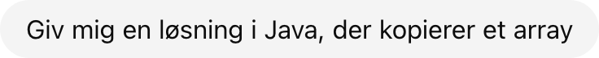
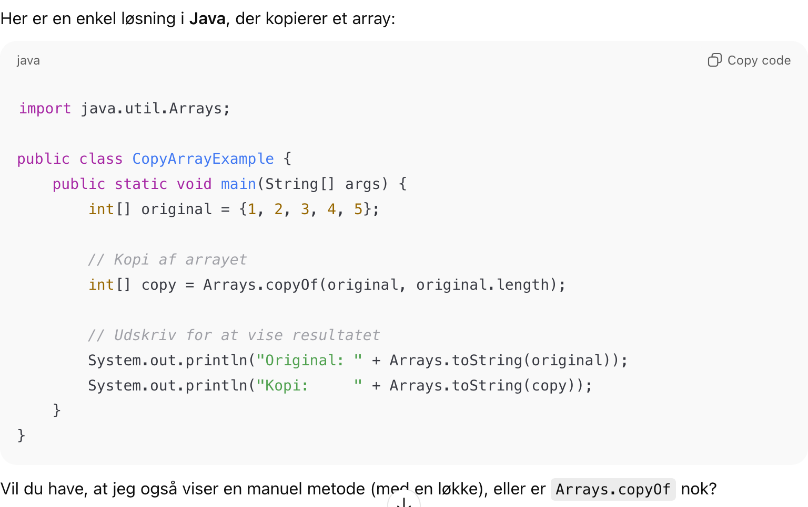

<!-- .slide: class="cover-14" -->

# Diskussion

--

Husker i: Øvelsen `copycat`

--

Lad os bruge ChatGPT

--

Prompt:

--

--

For mange muligheder - vi prøver igen

--

--

Problemet

--

Påstand:  
Vi bliver præsenteret for teknologi vi ikke kender

--

Påstand:  
Vi kommer til at bruge tiden på at forstå ChatGPTs svar i stedet for at løse opgaven og lære pointerne fra opgaven

--

Påstand:  
Vi læser svaret og får en falsk fornemmelse af at vi forstår det

--

Påstand:  
Vi kommer ikke igennem den læringsproces der sker når vi selv prøver at løse opgaven

--

Påstand:  
Vi lærer ikke at fejlsøge og forstå fejlmeddelelser

--

Påstand:  
Vi gør os afhængige af ChatGPT

--

