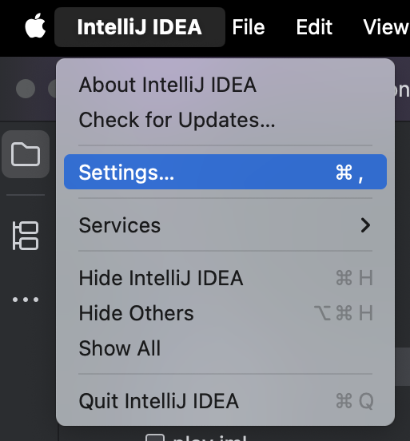

# Installation af IntelliJ IDEA

For at få hjælp til at skrive Java-kode, skal vi installere et udviklingsmiljø, der hedder **IntelliJ IDEA**. Det er et program, der hjælper os med at skrive, organisere og køre vores Java-kode.

- Gå til [https://www.jetbrains.com/idea/download/](https://www.jetbrains.com/idea/download/)
- Download **ikke** IntelliJ IDEA **Ultimate**
- **Scroll** ned til IntelliJ IDEA **Community Edition**
    
- Klik "Download"

## Installér

- Åbn den downloadede fil for at starte installationen
- Følg installationsvejledningen og klik "Next", "Continue", o.lign. indtil installationen er færdig

## Start IntelliJ IDEA

- Start IntelliJ IDEA
- Find den i Start-menuen (Windows) eller i Spotlight (macOS)
- Hvis du bliver spurgt om at importere indstillinger, så vælg **Do not import settings**

# Opsætning af IntelliJ IDEA

- Vi skal konfigurere IntelliJ IDEA, så den passer til vores behov

- Al konfiguration foregår i **Settings** vinduet
- I vinduet finde og klikke på **Settings** i menuen
- I Windows er det under **File** → **Settings**
- I macOS er det i topmenuen under **IntelliJ IDEA** → **Preferences**
    

# Deaktiver AI/ML værktøjer

- I venstre sidepanel, klik på **Plugins**
- Til højre vælg fanen **Installed**
- Scroll ned til du finder bjælken **Local AI/ML Tools**
- Klik på **Disable all**
- Tjek at alt under **Local AI/ML Tools** er deaktiveret, som her:

- Klik på **Ok** for at gemme ændringerne
- Måske skal du genstarte IntelliJ IDEA for at ændringerne træder i kraft

# Deaktiver kode sammenfoldning

- I venstre sidepanel, klik på **Editor** → **General** → **Code Folding**
- Scroll ned til du finder **Java**
- Fjern alle flueben under **Java**, så det ligner billedet herunder
- Dette deaktiverer sammenfoldning af kode, der kan skjule kode og skabe forvirring
- Klik på **Ok** for at gemme ændringerne

# Deaktiver kode inlay hints

- I venstre sidepanel, klik på **Editor** → **Inlay Hints**
- Fjern fluebenet ved **Code Vision** og **Parameter hints**, så det ligner billedet herunder
- Dette deaktiverer ekstra informationer i koden, som kan være forstyrrende for begyndere
- Klik på **Ok** for at gemme ændringerne

--

# Deaktiver unødvendige funktioner

- I venstre sidepanel, klik på **Version Control** → **Commit**
- **Sæt flueben** ved **Clear initial commit message**
- **Fjern flueben** i alle bokse under **Commit Checks**, **Advaced Commit Checks**, samt i **Run advanced checks after a commit is done**
- Klik på **Ok** for at gemme ændringerne, hvis et ser ud som billedet herunder

## 🎉
Yay! Nu er IntelliJ IDEA klar til brug!
