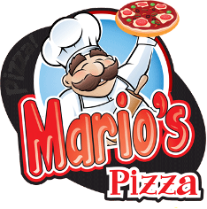
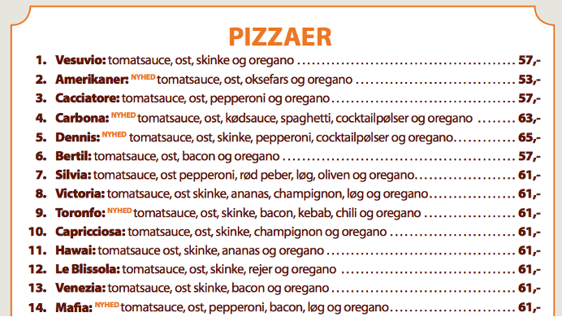

## Baggrund

Mario har en lille pizzabar på Nørrebrogade og sælger pizzaer ud af huset. Han har lidt svært ved at holde styr på ordrerne, og kunne godt tænke sig et system, som en dag kunne blive en online-shop til håndtering af bestillinger. Vi har fået til opgave at hjælpe ham med at lave en simpel løsning i Java. Programmet skal bare kunne køre på hans gamle laptop, som står i pizzeriaet.

Efter et kort møde med Mario, har vi fået følgende ud af ham:

“Jeg kunne godt tænke mig hele tiden at kunne se en liste med bestillingerne, og hvornår de skal afhentes. Jeg har over 30 forskellige pizzaer, og de fleste kunder ringer og bestiller en times tid i forvejen. Nogle kommer også direkte ind i butikken.

Det ville være rart at have mulighed for at se hele mit menukort på skærmen, så man kan se på det, når der er en kunde i telefonen eller ved disken.

Min nevø, Alfonso, tager imod bestillinger, så han kan indtaste ordrerne. Han tager sig af at betjene computeren. Jeg skal bare kunne se listen over bestillingerne og på en eller anden måde få at vide, hvilken pizza, der nu skal laves. Måske kunne man sortere dem efter tidspunkt. Det kan jeg ikke helt gennemskue. Bare det bliver let for mig.

Når jeg har lavet en pizza, skal jeg kunne råbe til min nevø, når pizzaen er klar. Så kan han fjerne den fra listen, når den er afhentet og betalt.

Jeg vil gerne kunne gemme alle ordrerne, når de ekspederet. På den måde vil jeg kunne se omsætningen, og senere lave statistik på hvilke pizzaer, der er mest populære. Det ville også være rart, hvis jeg kunne ændre i priserne”

Nice to have: registrering af faste kunder, som man kunne tilbyde rabatter ud fra en betragtning om, at opgaven umiddelbart ikke er særlig stor. Tilbud om udbringning kunne være en anden mulighed.

## Opgavebeskrivelse

Underviser påtager sig rollerne som Mario og Alfonso, så I kan få uddybet, hvis der mangler afgørende information.

## Krav til IT- og Forretningsforståelse
Lav en ”PROJEKT- SWOT ANALYSE” der beskriver projektets interne styrker (Strengths), projektets svagheder (Weakness), projektets muligheder (Opportunites) samt projektets (Threats). Find inspiration i Figur 4.18 i bogen ”Projektledelse”.  PowerPoint-præsentation med risikoanalyse og risikoplan over projektet.

Lav dernæst en ”PROJEKT RISIKO OVERSIGT” med udgangspunkt i de identificerede ”Weaknesess” og ”Threats” taget fra projekt-SWOT analysen”.  Foretag en vægtning 1-5 i oversigten, hvor ”5” udtrykker størst sandsynlighed samt størst Konsekvens”.
Find inspiration i Figur 4.19 i bogen Projketledelse.

Afslutningsvist; udform en ”RISIKOANALYSE” grafisk, hvor de identificerede faktorer plottes ind og beskriv hvilke faktorer, der ligger så højt, at omkostmingsreducerende tiltag bør iværksættes.
Find inspiration i Figur 4.20 i bogen “Projektledelse”.

### Aflevering til IT- og Forretningsforståelse
Aflevering i PP format indeholdende figurerne 4.18, 4.19 samt 4.20 med indhold fra Marios Pizzabar casen.

## Krav til Systemudvikling
Projekt rapport med:
- Requirements list
  I skal starte med i punktform at finde frem til den liste af features, som ønskes til det kommende system.   
- Liste over Functional/Non-Functionalor eller FURPS(+)  
- Disse features beskrives herefter som user stories i formatet:  
  &lt;As a role&gt;, I can &lt;activity&gt;, so that &lt;goal&gt;
- Opret et Trello board (eller lignende) til jeres user stories og brug det til at holde status (f.eks. Ready,   in-progress, done status kolonner) på opgaver igennem projektet. Tag nogle screen shots af jeres board undervejs, så I kan vise hvordan I har brugt det.
- Udarbejd en Domain Model for casen 

### Aflevering til Systemudvikling
Projektrapport - Alle artefakter samles og afleveres i en PDF-fil.

## Krav til Programmering
- Applikationen skal udvikles på baggrund af analyse og design.
- Applikationen skal udvikles med objekt orienteret design. 
- Applikationen skal have et brugerinterface, som I kan demonstrere ved præsentationen af jeres projekt.
- Overvej at anvende tests i jeres udvikling.

### Aflevering til Programmering
Al kode, dvs. hele IntelliJ projektet pakkes i en zip-fil.

## Afleveringsfrist
På ItsLearning senest fredag den 31. oktober kl 16.00:

## Afleveringsformat
- Projektrapport i PDF format
- zip-fil med kode-projekt

## Præsentation
Gruppen præsenterer sit projekt for undervisere og 10 minutters fremlæggelse. Præsentationen skal indeholde:
- Demonstration af jeres applikation
- Gennemgang af særlige kodeeksempler og/eller designvalg, som kunne være interessante for de andre studerende