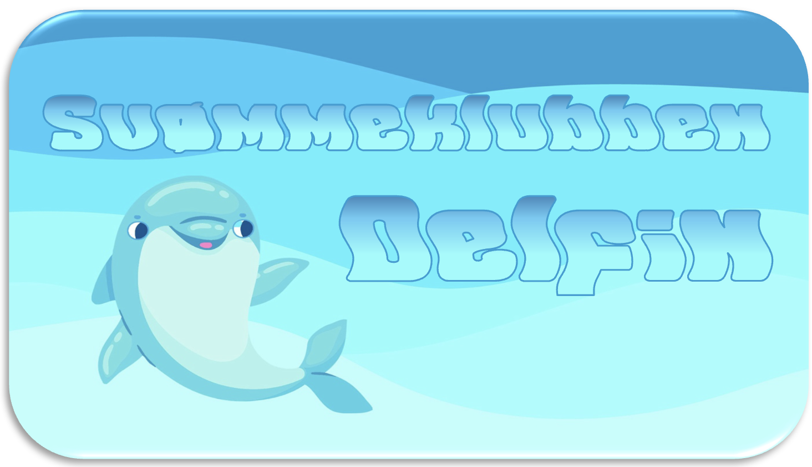

# Baggrund
Svømmeklubben Delfinen er en mindre klub, der er i vækst. Klubbens ledelse ønsker derfor udviklet et administrativt system til at styre medlemsoplysninger, kontingenter og svømmeresultater. Efter samtale med klubbens formand, tegner der sig følgende billede af arbejdsopgaverne, som systemet skal understøtte.

Det er klubbens formand, der tager sig af nye medlemmer. Ved indmeldelse i klubben registreres diverse stamoplysninger om personen, herunder alder. Desuden registreres oplysninger om personens ønskede aktivitetsform, det vil sige aktivt eller passivt medlemskab, junior- eller seniorsvømmer, motionist eller konkurrencesvømmer.

Klubbens kasserer tager sig af alt vedrørende kontingentbetaling. Kontingentets størrelse er betinget af flere forhold: For aktive medlemmer er kontingentet for ungdomssvømmere (under 18 år) 1000 kr. årligt, for seniorsvømmere (18 år og over) 1600 kr. årligt. For medlemmer over 60 år gives der 25 % rabat af seniortaksten. For passivt medlemskab er taksten 500 kr. årligt.

Kassereren vil gerne kunne danne sig et overblik over hvor meget klubben kan forvente at få indbetalt i kontingent i alt. Kassereren har desuden ønsket, at systemet kan vise en oversigt over medlemmer, der er i restance.
Konkurrencesvømmerne har tilknyttet en træner. Konkurrencesvømmerne er inddelt i 2 hold efter alder. Ungdomsholdet er for svømmere under 18 år. Seniorholdet er for svømmere på 18 og over. Hver konkurrencesvømmer er desuden registreret i forhold til hvilke svømmediscipliner, svømmeren er aktiv i.

Inden for hver svømmedisciplin registreres den enkelte svømmers bedste træningsresultat og dato løbende. For de svømmere, der har deltaget i konkurrencer, registreres stævne, placering og tid. Det er på baggrund af de enkelte svømmeres resultater, at træneren udtager svømmere til deltagelse i konkurrencer. Træneren ønsker derfor en oversigt, der kan vise klubbens top 5 svømmere inden for hver svømmedisciplin (butterfly, crawl, rygcrawl og brystsvømning), fordelt på henholdsvis junior og seniorsvømmere.
 
# Krav til projektet
## IT- og Forretningsforståelse
Med udgangspunkt i casen om Svømmeklubben Delfinen skal der udarbejdes følgende analyser:
- En interessent analyse
- En risikoanalyse

## Systemudvikling
I skal starte med i punktform at finde frem til kundens ønskede features.

Disse features beskrives herefter som user stories i formatet:
{As a role}, I can {activity},  so that {goal}

For de user stories, I får implementeret, er det vigtigt at:
- der er beskrevet acceptkriterier ("how to demo")
- de følger *INVEST*-princippet:
   - *I*ndependent <small>(of all others)</small>
   - *N*egotiable <small>(not a specific contract for features)</small>
   - *V*aluable
   - *E*stimable <small>(to a good approximation)</small>
   - *S*mall <small>(so as to fit within an iteration)</small>
   - *T*estable <small>(in principle, even if there isn’t a test for it yet)</small>

Følgende skal med i projekt rapporten:
-	Produkt vision
-	Liste med alle Krav
-	Kravsliste nedbrudte til FURPS eller Functional/Non-Functional Requirements
-	Domain Model (DM)
-	Lav et klassediagram for systemet
-	Liste over alle krav som User Stories
-	Product & Sprint Backlog
-	Dokumentation for gennemførsel af 2 sprints
-	Minimum 3 Sequence diagram (SD) over et eller flere scenarier
-	Dokumentation for brug af udvalgte accepttests

## Programmering
I skal designe og kode programmet efter objektorienterede principper for at gøre koden:
-	genbrugelig
-	vedligeholdelsesvenlig
-	robust
 
Der skal være en tekstbaseret brugergrænseflade med al den funktionalitet i kan udlede af opgavebeskrivelsen.

Øvrige ikke-funktionelle krav:
-	Tekstbaseret brugergrænseflade
-	Mulighed for at gemme/hente relevant data i filer
-	Logisk opdeling af relaterede klasser i packages
- Egne (custom) exceptions hvor det er relevant
-	Flere unit tests af – som minimum - ved beregning af kontingent
- Sortering vha. Comparable og/eller Comparator hvor det er relevant
- Brug af interfaces hvor det er relevant
 
# Gruppearbejde
Alle gruppemedlemmer skal bidrage ligeligt til alle dele af projektet. Ved præsentationen kan underviserne stille spørgsmål til alle gruppemedlemmer om alle dele af projektet.

Det anbefales at anvende GitHub til versionsstyring af koden, så alle gruppemedlemmer kan bidrage til kodningen.
Opgaven er obligatorisk – det er et deltagelseskrav for at blive indstillet til eksamen!
 
# Aflevering
## Hvad
Der skal afleveres en rapport i pdf-format, der indeholder følgende elementer:
- Forside der indeholder:
   - Gruppens navn
   - Link til GitHub repository til koden
   - Navne og GitHub brugernavne på alle gruppemedlemmer
- Indholdsfortegnelse
- IT- og Forretningsforståelse delen
- Systemudviklingsdelen
 
## Hvordan
Upload pdf’en som besvarelse på denne opgave på itslearning.

## Hvornår
Afleveringsfristen er fredag den 12. december kl. 16.00
